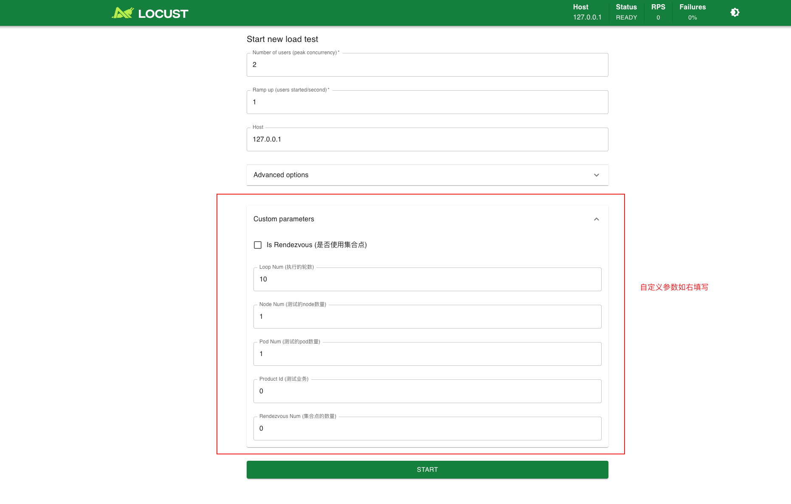
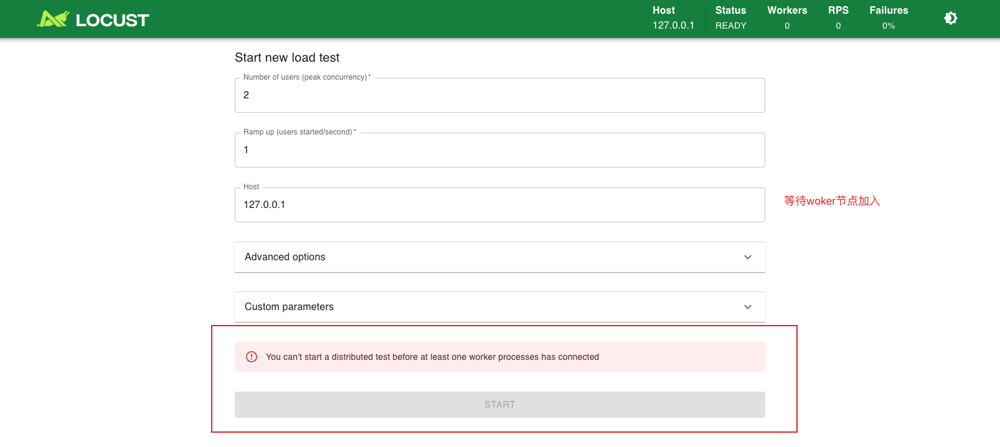
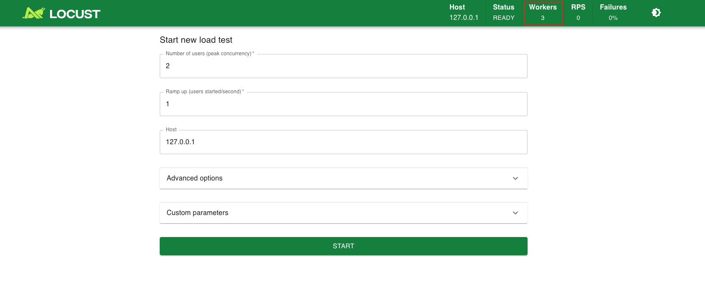
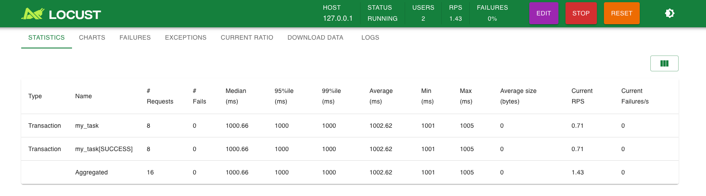
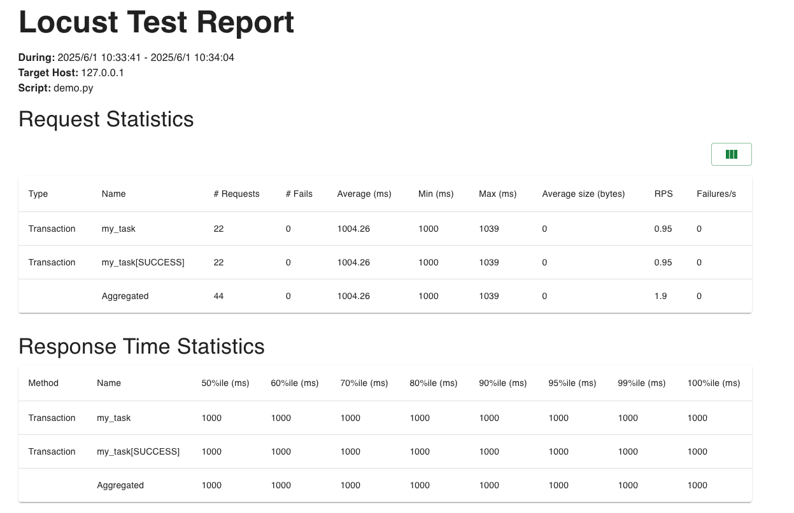
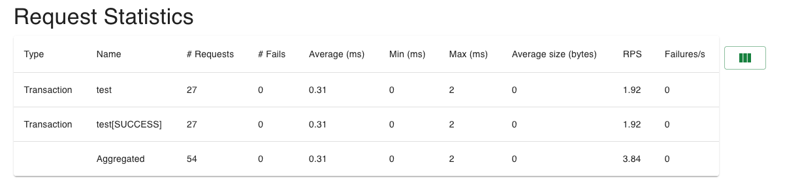
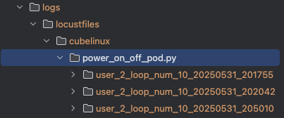
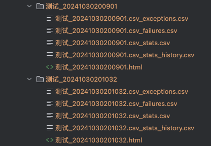

# 🚀 Locust性能测试框架

[](https://python.org)
[](https://locust.io)
[](LICENSE)
[](docs/README.md)

> 🎯 **企业级性能测试解决方案** - 基于Locust框架的二次开发，支持分层架构、松耦合、高内聚的设计原则

一个功能强大、易于扩展的性能测试框架，专为现代化测试需求而设计。框架采用插件化架构，支持多种负载模式、实时监控、智能分析和多渠道告警，让性能测试变得更加简单高效。

## ✨ 核心特性

### 🎯 **测试执行增强**
- **集合点功能** - 支持并发事务同步执行
- **自定义事务** - 灵活的事务统计和报告
- **自定义参数** - 动态参数传递和配置
- **优雅停止** - 智能的测试终止机制

### 📊 **数据管理**
- **动态数据获取** - 支持CSV、数据库、API等多种数据源
- **分布式数据编排** - 智能的数据分发和同步
- **测试数据生成** - 基于Faker的多样化数据生成
- **数据提供策略** - 轮询、随机、顺序等分发策略

### 📈 **性能分析**
- **智能评级系统** - A-D等级自动评估
- **多维度指标** - 响应时间、吞吐量、错误率等
- **趋势分析** - 历史数据对比和预测
- **可视化报告** - 丰富的图表和报告模板

### 🔔 **监控告警**
- **实时监控** - 系统资源和性能指标监控
- **多级告警** - 信息、警告、严重等级别
- **多渠道通知** - 飞书、钉钉、邮件、企业微信
- **告警规则** - 灵活的阈值配置和触发条件

### 🔌 **插件生态**(试用版,有bug)
- **插件架构** - 多种插件类型支持
- **热插拔** - 动态加载和卸载插件
- **扩展接口** - 标准化的插件开发接口
- **内置插件** - 丰富的开箱即用功能

### 🌊 **负载形状**
- **7种负载模式** - 波浪、阶梯、尖峰、自适应等
- **自定义形状** - 支持复杂负载场景设计
- **动态调整** - 运行时负载参数调整
- **场景编排** - 多阶段负载组合

### 🔗 **平台集成**
- **第三方集成** - 支持嵌入测试平台(PS:已经嵌入到个人开发的[测试平台](https://www.coder-ljx.cn:7524/user/login))
- **API接口** - 完整的REST API

## 🚀 快速开始

### 安装要求

- Python 3.7+
- 推荐使用虚拟环境

### 快速安装

```bash
# 克隆项目
git clone git@github.com:ljxpython/locust_framework.git
cd locust_framework

# 创建虚拟环境
python -m venv venv
source venv/bin/activate  # Linux/Mac
# 或 venv\Scripts\activate  # Windows

# 安装依赖
pip install -r requirements.txt
```

### 5分钟上手

1. **创建测试脚本**
```python
# locustfiles/quickstart.py
from locust import HttpUser, task
from src.utils.locust_report import manual_report

class QuickStartUser(HttpUser):
    host = "https://httpbin.org"

    @task
    def test_get(self):
        with manual_report("GET请求测试"):
            self.client.get("/get")

    @task(2)  # 权重为2
    def test_post(self):
        with manual_report("POST请求测试"):
            self.client.post("/post", json={"key": "value"})
```

2. **启动Web UI测试**
```bash
# 使用Make命令（推荐）
make run-web script=locustfiles/quickstart.py

# 或使用原生Locust命令
locust -f locustfiles/quickstart.py
```

3. **访问Web界面**
   - 打开浏览器访问 http://localhost:8089
   - 设置用户数和启动速率
   - 开始测试并查看实时结果

4. **无头模式测试**
```bash
# 快速执行
make run script=locustfiles/quickstart.py u=10 r=2 t=60s

# 完整参数
locust -f locustfiles/quickstart.py --headless -u 10 -r 2 -t 60s --html=reports/report.html
```

### 📚 详细文档

- **[📖 完整文档](docs/README.md)** - 详细的使用指南和API参考
- **[🚀 快速开始](docs/getting-started/quickstart.md)** - 5分钟快速上手
- **[🏗️ 架构设计](docs/architecture/overview.md)** - 系统架构和设计理念
- **[🔌 插件开发](docs/development/plugin-development.md)** - 插件开发完整指南
- **[⚙️ 配置参考](docs/configuration/framework-config.md)** - 详细配置说明
- **[💡 使用示例](docs/examples/basic-examples.md)** - 丰富的实战示例

## 📁 项目结构

```
locust_framework/
├── 📁 conf/                    # 配置文件
│   ├── config.py              # 配置管理
│   ├── constants.py           # 常量定义
│   └── settings.yaml          # 主配置文件
├── 📁 docs/                    # 文档系统
│   ├── getting-started/       # 入门指南
│   ├── architecture/          # 架构文档
│   ├── api/                   # API参考
│   ├── development/           # 开发指南
│   ├── examples/              # 使用示例
│   └── configuration/         # 配置参考
├── 📁 locustfiles/             # 测试脚本
│   ├── demo.py               # 示例脚本
│   ├── shape_classes/        # 负载形状类
│   └── test_*/               # 测试场景目录
├── 📁 src/                     # 核心源码
│   ├── analysis/             # 性能分析模块
│   ├── monitoring/           # 监控告警模块
│   ├── data_manager/         # 数据管理模块
│   ├── plugins/              # 插件系统
│   ├── notifications/        # 通知服务
│   ├── load_shapes/          # 负载形状
│   ├── client/               # 客户端封装
│   ├── model/                # 数据模型
│   └── utils/                # 工具模块
├── 📁 reports/                 # 测试报告
├── 📁 logs/                    # 日志文件
├── main.py                   # 主程序入口
├── requirements.txt          # 依赖列表
└── README.md                # 项目说明
```

## 🎯 主要功能详解

### 🔧 自定义参数系统

框架支持灵活的参数传递和配置管理，让测试更加可控和可配置。

**核心特性：**
- ✅ 支持指定轮数`loop_num`后自动停止压测
- ✅ 支持使用集合点且自定义集合数`rendezvous_num`
- ✅ 支持其他业务相关参数通过Web/终端传入
- ✅ 环境变量和配置文件支持

### 📊 智能性能分析

基于多维度指标的智能分析系统，提供专业的性能评估。

**分析维度：**
- 📈 **响应时间分析** - P50/P90/P95/P99百分位数
- 🚀 **吞吐量分析** - TPS、并发处理能力
- ❌ **错误率分析** - 错误分布和根因分析
- 📊 **稳定性分析** - 性能波动和趋势预测
- 🎯 **综合评级** - A-D等级自动评估

### 🔔 多渠道告警通知

实时监控和智能告警，确保问题及时发现和处理。

**支持渠道：**
- 🚀 **飞书** - 支持富文本消息和@功能
- 📱 **钉钉** - 群机器人消息推送
- 📧 **邮件** - SMTP邮件通知
- 💬 **企业微信** - 企业内部消息通知

### 🌊 多样化负载形状

支持7种内置负载模式，满足不同测试场景需求。

**负载模式：**
- 📈 **波浪形** - 周期性负载变化
- 🏗️ **阶梯形** - 逐步递增负载
- ⚡ **尖峰形** - 突发流量测试
- 🎯 **自适应** - 基于响应时间自动调整
- 📊 **自定义** - 灵活的负载场景编排

### 🔌 插件化架构

强大的插件系统，支持功能扩展和定制化开发。

**插件类型：**
- 🧪 **Locust插件** - 扩展Locust核心功能
- 📊 **报告插件** - 自定义报告格式和内容
- 📡 **监控插件** - 系统和应用监控
- 💾 **数据插件** - 数据源和存储扩展
- 🔔 **通知插件** - 消息通知渠道扩展

### 🎯 分布式测试支持

天然支持分布式部署，轻松应对大规模性能测试需求。

**分布式特性：**
- 🏗️ **Master-Worker架构** - 支持多节点协同
- 📊 **数据同步** - 智能的测试数据分发
- 📈 **负载均衡** - 自动负载分配和调度
- 🔄 **故障恢复** - 节点故障自动处理

---

## 📋 原有功能说明

> 基于locust框架进行二次开发: https://locust.io/
>
> 主要封装完善功能如下:
>
> 1. 集合点
> 2. 自定义事务
> 3. 自定义参数
> 4. 测试数据的动态获取及编排(可支持分布式的资源编排)
> 5. 压测报告优化
> 6. 优雅的停止压测
> 7. 第三方调用(该框架已经接入到作者自己开发的测试平台中)
> 8. 自动告警(支持邮件\飞书\钉钉群等消息上报)
> 9. 一些其他小的优化项


---

## 📖 使用指南

### 🎯 测试执行方式

框架支持多种测试执行方式，满足不同场景需求：

#### 1. Web UI模式（推荐新手）

```bash
# 使用Make命令启动
make run-web script=locustfiles/demo.py

# 或使用原生Locust命令
locust -f locustfiles/demo.py
```

**特点：**
- 🌐 友好的Web界面
- 📊 实时监控和图表
- ⚙️ 可视化参数配置
- 📈 动态负载调整

#### 2. 无头模式（适合CI/CD）

```bash
# 快速执行
make run script=locustfiles/demo.py u=10 r=2 t=60s

# 完整参数执行
locust -f locustfiles/demo.py --headless \
    --users 10 --spawn-rate 2 --run-time 60s \
    --html=reports/report.html \
    --csv=reports/results
```

**特点：**
- 🚀 自动化执行
- 📋 命令行参数控制
- 📊 自动生成报告
- 🔄 适合持续集成

#### 3. 分布式模式（大规模测试）

```bash
# 启动Master节点
locust -f locustfiles/demo.py --master

# 启动Worker节点
locust -f locustfiles/demo.py --worker --master-host=<master-ip>

# 多进程Worker
locust -f locustfiles/demo.py --worker --processes 4
```

**特点：**
- 🏗️ 多节点协同
- 📈 线性扩展能力
- 🔄 故障自动恢复
- 📊 统一结果收集

### 🔧 自定义参数配置

框架提供强大的参数化能力，支持灵活的测试配置：

#### 参数定义示例

```python
@events.init_command_line_parser.add_listener
def _(parser):
    parser.add_argument("--product_id", type=str, default="1925511528732168192", help="测试业务ID")
    parser.add_argument("--loop_num", type=int, default=1, help="执行轮数")
    parser.add_argument("--is_rendezvous", type=str_to_bool, default=False, help="是否使用集合点")
    parser.add_argument("--rendezvous_num", type=int, default=1, help="集合点数量")
```

#### 参数使用示例

```python
class WebsiteUser(HttpUser):
    @task
    def my_task(self):
        # 获取自定义参数
        loop_num = self.environment.parsed_options.loop_num
        product_id = self.environment.parsed_options.product_id

        # 使用集合点
        if self.environment.parsed_options.is_rendezvous:
            with self.environment.shared:
                # 并发执行的业务逻辑
                self.client.get(f"/api/product/{product_id}")
```

### 📊 性能分析和报告

框架提供智能的性能分析和丰富的报告功能：

#### 自动性能分析

- **响应时间分析** - P50/P90/P95/P99百分位数
- **吞吐量分析** - TPS和并发处理能力
- **错误率分析** - 错误分布和根因分析
- **综合评级** - A-D等级自动评估

#### 多格式报告

- **HTML报告** - 交互式图表和详细分析
- **CSV数据** - 原始数据导出和二次分析
- **JSON格式** - API集成和自动化处理
- **实时监控** - Web界面实时数据展示

### 🔔 监控告警配置

#### 告警规则配置

```yaml
# conf/settings.yaml
monitoring:
  alerts:
    response_time:
      warning: 1000  # 1秒警告
      critical: 3000 # 3秒严重
    error_rate:
      warning: 5     # 5%警告
      critical: 10   # 10%严重
    throughput:
      warning: 100   # 低于100 TPS警告
```

#### 通知渠道配置

```yaml
notifications:
  feishu:
    webhook_url: "https://open.feishu.cn/open-apis/bot/v2/hook/xxx"
    enabled: true
  dingtalk:
    webhook_url: "https://oapi.dingtalk.com/robot/send?access_token=xxx"
    enabled: true
  email:
    smtp_server: "smtp.gmail.com"
    smtp_port: 587
    enabled: true
```

### 🌊 负载形状使用

框架支持多种负载模式，模拟真实的用户行为：

#### 使用负载形状

```python
# 在测试脚本中继承负载形状类
from locustfiles.shape_classes.wave_shape import WaveLoadShape

class MyTestUser(HttpUser):
    # 测试逻辑
    pass

# 使用命令行选择负载形状
locust -f test.py --class-picker WaveLoadShape
```

#### 可用负载模式

- **WaveLoadShape** - 波浪形负载
- **SpikeLoadShape** - 尖峰负载
- **StairStepLoadShape** - 阶梯负载
- **AdaptiveLoadShape** - 自适应负载

### 🔌 插件使用

#### 启用插件

```yaml
# conf/settings.yaml
plugins:
  enabled:
    - performance_analyzer
    - system_monitor
    - notification_service
    - data_manager
```

#### 自定义插件

```python
from src.plugins.base import BasePlugin

class MyCustomPlugin(BasePlugin):
    def on_test_start(self, environment, **kwargs):
        # 测试开始时的逻辑
        pass

    def on_test_stop(self, environment, **kwargs):
        # 测试结束时的逻辑
        pass
```

---

## 📋 详细功能说明

### 🔧 自定义参数详细说明

框架支持灵活的参数传递和配置管理：

1. **封装测试框架** - 支持指定轮数`loop_num`后自动停止压测
2. **集合点功能** - 支持使用集合点且自定义集合数`rendezvous_num`
3. **业务参数** - 支持其他业务相关参数通过web/终端传入

### 📊 智能性能分析

基于多维度指标的智能分析系统：

- **响应时间分析** - P50/P90/P95/P99百分位数统计
- **吞吐量分析** - TPS和并发处理能力评估
- **错误率分析** - 错误分布和根因分析
- **稳定性分析** - 性能波动和趋势预测
- **综合评级** - A-D等级自动评估系统

### 🔔 多渠道告警通知

实时监控和智能告警系统：

- **飞书通知** - 支持富文本消息和@功能
- **钉钉通知** - 群机器人消息推送
- **邮件通知** - SMTP邮件告警
- **企业微信** - 企业内部消息通知

### 🌊 多样化负载形状

支持7种内置负载模式：

- **波浪形负载** - 周期性负载变化模拟
- **阶梯形负载** - 逐步递增负载测试
- **尖峰形负载** - 突发流量压力测试
- **自适应负载** - 基于响应时间自动调整
- **自定义负载** - 灵活的负载场景编排

### 🎯 分布式测试支持

天然支持分布式部署：

- **Master-Worker架构** - 支持多节点协同测试
- **数据同步机制** - 智能的测试数据分发
- **负载均衡** - 自动负载分配和调度
- **故障恢复** - 节点故障自动处理机制

---
```bash
.
├── README.md
├── conf
│   ├── config.py
│   ├── constants.py
│   ├── settings.local.yaml
│   └── settings.yaml
├── docs
│   └── pics
│       └── img.png
├── locustfiles
│   ├── demo.py
│   ├── shape_classes
│   │   └── __init__.py
│   ├── test.py
│   ├── test_demo
│   │   └── test_good.py
│   └── test_user
│       ├── __init__.py
│       ├── __pycache__
│       │   └── test_user.cpython-312.pyc
│       └── test_user.py
├── logs
│   └── test.log
├── main.py
├── poetry.lock
├── pyproject.toml
├── reports
├── requirements.txt
├── src
│   ├── client
│   │   ├── __init__.py
│   │   └── demo_client
│   │       ├── flask_auth.py
│   │       ├── flask_client.py
│   │       └── response.py
│   ├── model
│   │   ├── __init__.py
│   │   ├── __pycache__
│   │   │   ├── locust_test.cpython-312.pyc
│   │   │   └── modelsbase.cpython-312.pyc
│   │   ├── auto_pytest.py
│   │   ├── locust_test.py
│   │   └── modelsbase.py
│   └── utils
│       ├── __init__.py
│       ├── file_operation.py
│       ├── locust_report.py
│       ├── log_moudle.py
│       ├── rendezvous.py
│       ├── robot.py
│       └── util.py
├── stop_locust.py
└── stop_locust.sh


```


## 自定义参数如何使用

1. 封装测试框架,支持指定轮数`loop_num`后自动停止压测
2. 支持使用集合点且自定义集合数`rendezvous_num`
3. 支持其他业务相关参数通过web/终端传入


### 在压测文件内定义自定义参数

```
@events.init_command_line_parser.add_listener
def _(parser):
    parser.add_argument("--product_id", type=str, env_var="product_id", default="1925511528732168192", help="测试业务")
    parser.add_argument("--node_num", type=int, env_var="node_num", default=1, help="测试的node数量")
    parser.add_argument("--pod_num", type=int, env_var="pod_num", default=1, help="测试的pod数量")
    parser.add_argument("--loop_num", type=int, env_var="loop_num", default=1, help="执行的轮数")
    parser.add_argument("--is_rendezvous",  type=str_to_bool,default=False, help="是否使用集合点")
    parser.add_argument("--rendezvous_num", type=int, env_var="rendezvous_num", default=1, help="集合点的数量")
```

### 如何在压测任务中调用

使用`self.environment.parsed_options.xxxx` 的方式调用

```
class WebsiteUser(HttpUser):
    host = "127.0.0.1"
    @task
    def my_task(self):
        global num
        num += 1
        time.sleep(1)
        loop_num = self.environment.parsed_options.loop_num
        # 集合点
        if self.environment.parsed_options.is_rendezvous:
            with self.environment.shared:
                print('业务逻辑')
        # 当达到指定轮数后停止
        if loop_num < num:
            self.environment.runner.quit()  # 强制停止所有虚拟用户
```


### 无UI方式调用

- make方式执行

```
make run  script=locustfiles/xxxx.py u=2 r=1 is_rendezvous=false loop_num=10
```

- locust原生方式执行

```
locust -f locustfiles/cubelinux/xxxx.py --headless \
                --product_id 0 \
                --loop_num 10 \
                --rendezvous_num 0 \
                --is_rendezvous false \
                --csv=logs/xxx \
                --html=logs/locustfiles/xxxx.html \
                -u 2 -r 1 -t 5m -s 100

```


### UI方式调用

- make方式执行

```
make run-web  script=locustfiles/xxxx.py u=2 r=1 is_rendezvous=false loop_num=10
```

- locust原生方式执行

```
locust -f locustfiles/cubelinux/xxxx.py  \
                -u 2 -r 1 -t 5m -s 100

```


前端选择参数




## web UI 方式压测

可以在web页面选择压测场景的及其权重

可以在web页面选择自定义变量


- make方式执行

```
make run-web  script=locustfiles/xxxx.py u=2 r=1 is_rendezvous=false loop_num=10
```

- locust原生方式执行

```
locust -f locustfiles/cubelinux/xxxx.py  \
                -u 2 -r 1 -t 5m -s 100

```


## 无头方式压测

压测权重需预先标注,通过`--xxx xxx`的方式填写自定义变量

- make方式执行

```
make run  script=locustfiles/xxxx.py u=2 r=1 is_rendezvous=false loop_num=10
```

- locust原生方式执行

```
locust -f locustfiles/cubelinux/xxxx.py --headless \
                --product_id 0 \
                --loop_num 10 \
                --rendezvous_num 0 \
                --is_rendezvous false \
                --csv=logs/xxx \
                --html=logs/locustfiles/xxxx.html \
                -u 2 -r 1 -t 5m -s 100

```


## 如何分布式压测

当压测的量级比较大时,一台开发机或者单线程不能满足需求,就需要多线程多开发机配合了,这方面locust天然支持,就不需要我进行二次封装了,方式如下:

### 启动master节点

这一步是必须的,之后让其他的woker节点加入

```
locust -f locustfile.py --master
```



### woker节点加入

`processes ` 参数代表开启的进程数

```
# 同一服务器加入
 locust -f - --worker --processes 4
# 其他开发机
locust -f - --worker --processes 1  --master-host 127.0.0.1
```




这里只提到了如何运行分布式压测,但是对于分布式压测变量如何管理,数据如何分配,因为篇幅太长,我并没有做介绍,感兴趣的可以查阅我博客的相关章节

## 自定义场景编写

不需要考虑并发应该如何设计,只需要考虑单个user的代码逻辑编排,可以像接口测试一样,只关注接口的参数化\接口间关联传参\断言的处理

接口一般有同步接口和异步接口,对于异步接口,封装了轮训功能,可以定期轮训查询异步完成的功能

断言部分,支持常用的接口状态断言,响应结果断言,熟悉断言使用的方法后,可大大减轻脚本编写工作者的开发时间


## 自定义事务统计

```
from src.utils.locust_report import manual_report, measure

class WebsiteUser(HttpUser):
    host = "127.0.0.1"

    @task
    def my_task(self):
        with manual_report("my_task"):
            time.sleep(1)
        # 如果使用measure,需自定义实现开始及结束时间及exception
        measure(name="order", start_time=start_time,end_time=status['time'],exception=LocustError(f"host_id: {host} 订购失败"))

```

统计结果如下



HTML报告统计结果相同:







## 自定义压测策略

有时候我们希望的压测的模型不是先升然后平稳的运行,而是升降突然拉升等等一些模型的设计,在`locustfiles/shape_classes`目录下,封装几种场景的场景,也可以基于该场景进行二次开发

如何调用:在脚本中继承`locustfiles/shape_classes`下的相关类,在传参时加入`--class-picker`参数来选择要使用的形状即可


## 集合点如何使用

集合点:当需要指定事务同时执行时,需要使用集合点的功能,locust本身未提供需使用协程的信号量进行二次封装,支持参数指定或者动态指定集合数在集合点并发执行事务的功能

如下是一个简单的demo

```
from util.rendezvous import Rendezvous


@events.test_start.add_listener
def init_shared_service(environment, **kwargs):
    # 仅在Master节点或独立运行模式初始化
    if not isinstance(environment.runner, WorkerRunner):
        environment.shared = Rendezvous(environment.parsed_options.rendezvous_num)

class WebsiteUser(HttpUser):
    host = "127.0.0.1"
    @task
    def my_task(self):
        global num
        num += 1
        time.sleep(1)
        loop_num = self.environment.parsed_options.loop_num
        # 集合点
        if self.environment.parsed_options.is_rendezvous:
            with self.environment.shared:
                print('业务逻辑')
        # 当达到指定轮数后停止
        if loop_num < num:
            self.environment.runner.quit()  # 强制停止所有虚拟用户
```


## 压测报告优化

如果使用make方式执行,则在测试完成或者终止后,自动生成报告,也支持自动上传到云存储服务器中

测试报告的格式如下:



如果第三方接入,实现`main.py`中的`run_test()`方式,则测试报告格式如下:



## 测试数据的动态获取及编排(可支持分布式的资源编排)

这里说一下思路: 复杂的可以使用中间件,类似于Redis这些进行资源管理,简单的可以使用locust的原生`send_message`方法实现

既支持csv文件指定,也支持测试时,在前置准备环境生成测试数据,且动态分配给指定的user使用


## 其他使用方式

- 支持飞书\钉钉\邮箱等消息告警
- client优化
- log封装优化

该框架是基于locust进行的二次开发,使其变得更加好用

我在这里想说的,这只是一个工具,能帮助我们更好的完成性能测试,除了工具外,我认为更重要的还是,如何进行场景的设计及指标的设定,需求明确,才能把真正的风险暴露出来.

关于如何开展性能测试,感兴趣的小伙伴可以参考我的文章:性能测试那二三事


## 支持嵌入第三方测试平台使用

实现`main.py`中的`run_test()`方式即可

目前作者已经相关该框架嵌入到了自己的自动化测试平台中:https://www.coder-ljx.cn:7524/locust/locustcaselist


## locust 使用经验

请查阅作者博客的相关章节,里面总结了我在工作中各种场景下,使用locust进行压测的经验总结,希望能帮到你


---

## 🤝 贡献指南

欢迎所有形式的贡献！无论是bug报告、功能请求、代码贡献还是文档改进。

### 如何贡献

1. **Fork项目** - 点击右上角的Fork按钮
2. **创建分支** - `git checkout -b feature/your-feature-name`
3. **提交更改** - `git commit -am 'Add some feature'`
4. **推送分支** - `git push origin feature/your-feature-name`
5. **创建PR** - 在GitHub上创建Pull Request

### 贡献类型

- 🐛 **Bug修复** - 发现并修复问题
- ✨ **新功能** - 添加新的功能特性
- 📚 **文档改进** - 完善文档和示例
- 🧪 **测试用例** - 增加测试覆盖率
- 🔧 **工具优化** - 改进开发工具和流程

### 开发规范

- 遵循[编码规范](docs/development/coding-standards.md)
- 添加适当的测试用例
- 更新相关文档
- 确保CI/CD流程通过

## 📄 许可证

本项目采用 [MIT License](LICENSE) 开源协议。

## 🌟 致谢

感谢所有为这个项目做出贡献的开发者和用户！

特别感谢：
- [Locust](https://locust.io/) - 优秀的负载测试框架
- 所有提供反馈和建议的用户
- 开源社区的支持和贡献

## 📞 联系我

### 技术支持

### 作者联系方式

也欢迎和您交流讨论😊

**个人微信号**


---

**⭐ 如果这个项目对您有帮助，请给我一个Star！**

**🔗 项目链接**: [GitHub Repository](https://github.com/ljxpython/locust_framework)

**📖 在线文档**: [完整文档](docs/README.md)
