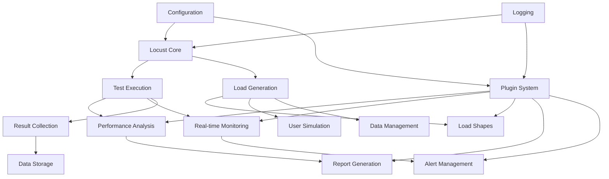
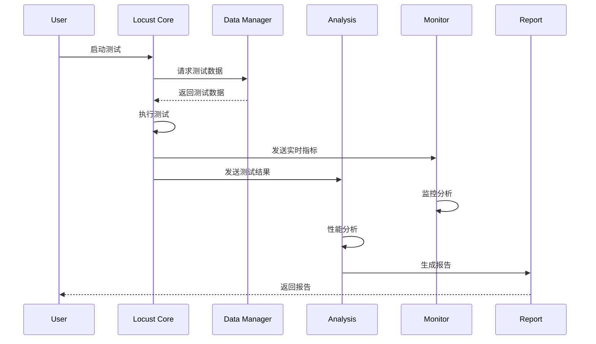
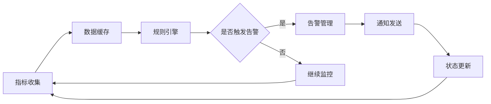
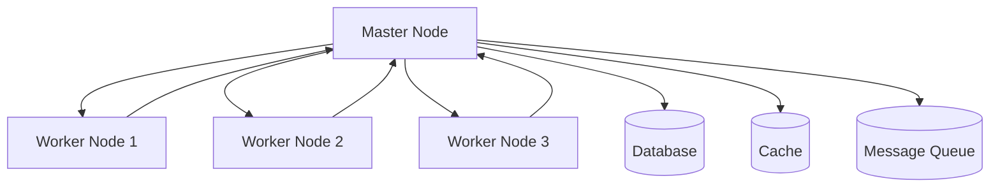

# 整体架构设计

本文档详细介绍Locust性能测试框架的整体架构设计，包括设计原则、架构模式和核心组件。

## 🎯 设计原则

### 1. 核心设计原则

#### 分层架构 (Layered Architecture)
- **表现层**: Web UI、CLI接口、API接口
- **业务层**: 测试逻辑、数据处理、业务规则
- **服务层**: 分析服务、监控服务、通知服务
- **数据层**: 数据访问、存储管理、缓存机制
- **基础层**: 日志、配置、工具、框架支持

#### 松耦合 (Loose Coupling)
- 模块间通过接口通信，减少直接依赖
- 使用事件驱动机制实现模块解耦
- 依赖注入和控制反转降低耦合度

#### 高内聚 (High Cohesion)
- 相关功能集中在同一模块内
- 模块内部功能紧密相关，职责明确
- 单一职责原则确保模块专注性

#### 可扩展性 (Extensibility)
- 插件化架构支持功能扩展
- 开闭原则：对扩展开放，对修改封闭
- 标准化接口便于第三方集成

## 🏗️ 架构概览

### 1. 整体架构图

```
┌─────────────────────────────────────────────────────────────────┐
│                        用户接口层                                │
├─────────────────┬─────────────────┬─────────────────────────────┤
│   Web UI        │   CLI Interface │   REST API                  │
│   (Locust Web)  │   (命令行工具)   │   (外部集成)                 │
└─────────────────┴─────────────────┴─────────────────────────────┘
                                │
┌─────────────────────────────────────────────────────────────────┐
│                        业务逻辑层                                │
├─────────────────┬─────────────────┬─────────────────────────────┤
│   测试编排       │   负载控制       │   结果处理                   │
│   (Test Orchestration) │ (Load Control) │ (Result Processing)  │
└─────────────────┴─────────────────┴─────────────────────────────┘
                                │
┌─────────────────────────────────────────────────────────────────┐
│                        服务层                                    │
├─────────┬─────────┬─────────┬─────────┬─────────┬─────────────┤
│ 性能分析 │ 实时监控 │ 数据管理 │ 插件系统 │ 通知服务 │ 报告生成     │
│ Analysis│ Monitor │ Data Mgr│ Plugins │ Notify  │ Reporting   │
└─────────┴─────────┴─────────┴─────────┴─────────┴─────────────┘
                                │
┌─────────────────────────────────────────────────────────────────┐
│                        数据访问层                                │
├─────────────────┬─────────────────┬─────────────────────────────┤
│   数据库访问     │   文件系统       │   缓存系统                   │
│   (Database)    │   (File System) │   (Cache)                   │
└─────────────────┴─────────────────┴─────────────────────────────┘
                                │
┌─────────────────────────────────────────────────────────────────┐
│                        基础设施层                                │
├─────────┬─────────┬─────────┬─────────┬─────────┬─────────────┤
│ 日志系统 │ 配置管理 │ 工具类   │ 异常处理 │ 安全认证 │ 网络通信     │
│ Logging │ Config  │ Utils   │ Exception│ Security│ Network     │
└─────────┴─────────┴─────────┴─────────┴─────────┴─────────────┘
```

### 2. 核心组件关系



## 🔧 核心组件架构

### 1. 性能分析组件 (Analysis)

```python
# 组件结构
src/analysis/
├── performance_analyzer.py    # 核心分析引擎
├── trend_analyzer.py         # 趋势分析
├── report_generator.py       # 报告生成
├── metrics_calculator.py     # 指标计算
└── __init__.py

# 架构特点
- 单一职责：专注性能数据分析
- 可扩展：支持自定义分析算法
- 高性能：优化的计算引擎
- 多格式：支持多种输出格式
```

#### 分析流水线
```
原始数据 → 数据清洗 → 指标计算 → 趋势分析 → 评分评级 → 报告生成
```

### 2. 监控告警组件 (Monitoring)

```python
# 组件结构
src/monitoring/
├── performance_monitor.py    # 性能监控
├── alert_manager.py         # 告警管理
├── notification_service.py  # 通知服务
├── metrics_collector.py     # 指标收集
└── __init__.py

# 架构特点
- 实时性：毫秒级监控响应
- 可配置：灵活的告警规则
- 多渠道：支持多种通知方式
- 高可用：容错和恢复机制
```

#### 监控流程
```
指标收集 → 规则评估 → 告警触发 → 通知发送 → 状态管理
```

### 3. 数据管理组件 (Data Manager)

```python
# 组件结构
src/data_manager/
├── data_generator.py        # 数据生成
├── data_provider.py         # 数据提供
├── data_distributor.py      # 数据分发
├── data_storage.py          # 数据存储
└── __init__.py

# 架构特点
- 智能生成：基于Faker的真实数据
- 多策略：支持多种分发策略
- 分布式：支持集群数据同步
- 高性能：优化的数据访问
```

#### 数据流转
```
数据生成 → 数据验证 → 数据存储 → 数据分发 → 数据消费
```

### 4. 插件系统组件 (Plugins)

```python
# 组件结构
src/plugins/
├── plugin_interface.py      # 插件接口定义
├── plugin_manager.py        # 插件管理器
├── plugin_loader.py         # 插件加载器
├── builtin/                 # 内置插件
│   └── csv_report_plugin.py
└── __init__.py

# 架构特点
- 标准化：统一的插件接口
- 动态加载：运行时插件管理
- 类型丰富：支持10+种插件类型
- 生命周期：完整的插件生命周期管理
```

#### 插件生命周期
```
发现 → 加载 → 验证 → 初始化 → 启用 → 运行 → 禁用 → 卸载
```

## 🔄 数据流架构

### 1. 测试数据流



### 2. 监控数据流



## 🔌 插件架构设计

### 1. 插件接口层次

```python
# 基础插件接口
class PluginInterface(ABC):
    @property
    @abstractmethod
    def plugin_info(self) -> PluginInfo:
        pass

    @abstractmethod
    def initialize(self, config=None) -> bool:
        pass

    @abstractmethod
    def cleanup(self):
        pass

# 专用插件接口
class ReportPlugin(PluginInterface):
    @abstractmethod
    def generate_report(self, test_data, output_path):
        pass

class MonitorPlugin(PluginInterface):
    @abstractmethod
    def collect_metrics(self) -> Dict[str, Any]:
        pass
```

### 2. 插件管理架构

```python
# 插件管理器架构
class PluginManager:
    def __init__(self):
        self.loader = PluginLoader()
        self.plugins = {}
        self.event_handlers = {}

    # 插件生命周期管理
    def discover_plugins(self) -> List[str]
    def load_plugin(self, name: str) -> bool
    def enable_plugin(self, name: str, config=None) -> bool
    def disable_plugin(self, name: str) -> bool

    # 事件系统
    def register_event_handler(self, event: str, handler)
    def trigger_event(self, event: str, data=None)
```

## 🏛️ 分布式架构

### 1. Master-Worker模式

```python
# Master节点职责
- 测试协调和控制
- 负载分发和调度
- 结果收集和聚合
- Web UI和API服务

# Worker节点职责
- 负载生成和执行
- 本地指标收集
- 结果上报
- 状态同步
```

### 2. 分布式通信



## 🔒 安全架构

### 1. 安全层次

```python
# 认证层
- 用户身份验证
- API密钥管理
- 会话管理

# 授权层
- 角色权限控制
- 资源访问控制
- 操作权限验证

# 数据安全层
- 数据加密存储
- 传输加密
- 敏感信息脱敏
```

### 2. 安全机制

```python
# 配置安全
- 敏感配置加密
- 环境变量隔离
- 配置文件权限控制

# 网络安全
- HTTPS通信
- 防火墙配置
- 网络隔离

# 运行时安全
- 输入验证
- SQL注入防护
- XSS防护
```

## 📊 性能架构

### 1. 性能优化策略

```python
# 计算性能
- 多线程并发处理
- 异步IO操作
- 内存池管理
- 算法优化

# 存储性能
- 数据库连接池
- 查询优化
- 索引设计
- 缓存策略

# 网络性能
- 连接复用
- 压缩传输
- 负载均衡
- CDN加速
```

### 2. 可扩展性设计

```python
# 水平扩展
- 分布式部署
- 负载均衡
- 数据分片
- 服务拆分

# 垂直扩展
- 资源优化
- 性能调优
- 硬件升级
- 算法改进
```

## 🔧 配置架构

### 1. 配置层次结构

```python
# 配置优先级
环境变量 > 命令行参数 > 用户配置 > 默认配置

# 配置文件结构
conf/
├── settings.toml           # 主配置文件
├── environments/           # 环境配置
│   ├── development.toml
│   ├── testing.toml
│   └── production.toml
├── plugins/               # 插件配置
│   └── plugin_config.json
└── logging.conf           # 日志配置
```

### 2. 配置管理机制

```python
# 动态配置
- 运行时配置更新
- 配置热重载
- 配置验证
- 默认值处理

# 配置安全
- 敏感信息加密
- 配置文件权限
- 环境隔离
- 审计日志
```

## 🚀 部署架构

### 1. 部署模式

```python
# 单机部署
- 开发测试环境
- 小规模测试
- 快速验证

# 分布式部署
- 大规模测试
- 高可用要求
- 性能要求高

# 云原生部署
- 容器化部署
- Kubernetes编排
- 弹性伸缩
- 服务网格
```

### 2. 容器化架构

```dockerfile
# 多阶段构建
FROM python:3.9-slim as builder
# 构建阶段

FROM python:3.9-slim as runtime
# 运行阶段

# 健康检查
HEALTHCHECK --interval=30s --timeout=3s --start-period=5s --retries=3 \
  CMD curl -f http://localhost:8089/health || exit 1
```

## 📈 监控架构

### 1. 监控层次

```python
# 应用监控
- 性能指标监控
- 业务指标监控
- 错误监控
- 日志监控

# 系统监控
- 资源使用监控
- 网络监控
- 存储监控
- 服务健康监控

# 基础设施监控
- 服务器监控
- 数据库监控
- 中间件监控
- 网络设备监控
```

### 2. 监控技术栈

```python
# 指标收集
- Prometheus
- Grafana
- InfluxDB
- StatsD

# 日志收集
- ELK Stack
- Fluentd
- Logstash
- Filebeat

# 链路追踪
- Jaeger
- Zipkin
- SkyWalking
- OpenTelemetry
```

## 🎯 架构演进

### 1. 版本演进路线

```python
# v1.0 - 基础版本
- 核心测试功能
- 基础报告生成
- 简单配置管理

# v2.0 - 增强版本 (当前)
- 性能分析模块
- 监控告警系统
- 插件化架构
- 数据管理系统

# v3.0 - 未来版本
- AI驱动的性能分析
- 云原生架构
- 微服务化
- 智能化运维
```

### 2. 技术债务管理

```python
# 代码质量
- 代码审查
- 单元测试
- 集成测试
- 性能测试

# 架构优化
- 模块重构
- 性能优化
- 安全加固
- 文档完善
```

---

这个架构设计确保了框架的可扩展性、可维护性和高性能，为用户提供了强大而灵活的性能测试解决方案。
