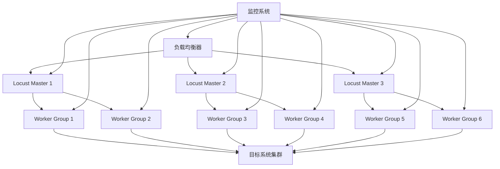

# 分布式配置

本文档详细介绍如何配置Locust性能测试框架的分布式部署，包括Master-Worker架构、集群管理和负载均衡配置。

## 🏗️ 分布式架构

### 架构概览



### 组件说明

```yaml
# distributed/architecture.yml
components:
  load_balancer:
    description: "负载均衡器，分发Web UI请求"
    technology: "Nginx/HAProxy/AWS ALB"
    ports: [80, 443]

  master_nodes:
    description: "Locust Master节点，协调测试执行"
    count: 3
    ports: [8089, 5557]
    resources:
      cpu: "2 cores"
      memory: "4GB"
      storage: "20GB"

  worker_groups:
    description: "Locust Worker节点组，执行实际测试"
    groups: 6
    workers_per_group: 10
    ports: []
    resources:
      cpu: "1 core"
      memory: "2GB"
      storage: "10GB"

  target_system:
    description: "被测试的目标系统"
    instances: "多实例"
    load_balancer: "独立负载均衡"

  monitoring:
    description: "监控和日志收集系统"
    components: ["Prometheus", "Grafana", "ELK Stack"]
```

## 🎛️ Master节点配置

### 1. 高可用Master配置

```yaml
# config/master-ha.yml
master_cluster:
  enabled: true
  nodes:
    - name: "master-1"
      host: "10.0.1.10"
      port: 5557
      web_port: 8089
      priority: 100

    - name: "master-2"
      host: "10.0.1.11"
      port: 5557
      web_port: 8089
      priority: 90

    - name: "master-3"
      host: "10.0.1.12"
      port: 5557
      web_port: 8089
      priority: 80

  # 选举配置
  election:
    enabled: true
    timeout: 30
    heartbeat_interval: 5

  # 数据同步
  synchronization:
    enabled: true
    sync_interval: 10
    conflict_resolution: "latest_wins"

# Master节点配置
master:
  # 绑定配置
  bind:
    host: "0.0.0.0"
    port: 5557

  # Web UI配置
  web:
    host: "0.0.0.0"
    port: 8089
    auth_credentials: "admin:secure_password"

  # Worker管理
  workers:
    expect_workers: 60  # 期望Worker数量
    expect_workers_max_wait: 120  # 最大等待时间
    heartbeat_liveness: 60  # 心跳存活时间
    heartbeat_interval: 3  # 心跳间隔

  # 负载分配
  load_distribution:
    strategy: "round_robin"  # round_robin, least_loaded, weighted
    rebalance_interval: 30

  # 故障处理
  fault_tolerance:
    worker_timeout: 60
    retry_failed_workers: true
    max_retries: 3

  # 资源限制
  resources:
    max_memory_usage: "4GB"
    max_cpu_usage: "80%"
    max_connections: 10000
```

### 2. Master启动脚本

```bash
#!/bin/bash
# scripts/start-master.sh

set -e

# 配置变量
MASTER_HOST=${MASTER_HOST:-"0.0.0.0"}
MASTER_PORT=${MASTER_PORT:-5557}
WEB_HOST=${WEB_HOST:-"0.0.0.0"}
WEB_PORT=${WEB_PORT:-8089}
LOCUSTFILE=${LOCUSTFILE:-"locustfiles/distributed.py"}
EXPECT_WORKERS=${EXPECT_WORKERS:-60}

# 日志配置
LOG_LEVEL=${LOG_LEVEL:-"INFO"}
LOG_FILE=${LOG_FILE:-"/var/log/locust/master.log"}

# 创建日志目录
mkdir -p $(dirname $LOG_FILE)

# 健康检查函数
health_check() {
    local max_attempts=30
    local attempt=1

    while [ $attempt -le $max_attempts ]; do
        if curl -f http://${WEB_HOST}:${WEB_PORT}/stats/requests > /dev/null 2>&1; then
            echo "Master is healthy"
            return 0
        fi

        echo "Health check attempt $attempt/$max_attempts failed"
        sleep 2
        ((attempt++))
    done

    echo "Master health check failed"
    return 1
}

# 启动Master
echo "Starting Locust Master..."
echo "Configuration:"
echo "  Host: ${MASTER_HOST}:${MASTER_PORT}"
echo "  Web UI: ${WEB_HOST}:${WEB_PORT}"
echo "  Locustfile: ${LOCUSTFILE}"
echo "  Expected Workers: ${EXPECT_WORKERS}"

# 启动命令
locust \
    --master \
    --master-bind-host=${MASTER_HOST} \
    --master-bind-port=${MASTER_PORT} \
    --web-host=${WEB_HOST} \
    --web-port=${WEB_PORT} \
    --expect-workers=${EXPECT_WORKERS} \
    --loglevel=${LOG_LEVEL} \
    --logfile=${LOG_FILE} \
    -f ${LOCUSTFILE} &

MASTER_PID=$!
echo "Master started with PID: $MASTER_PID"

# 等待启动
sleep 10

# 健康检查
if health_check; then
    echo "Master is running successfully"
    echo $MASTER_PID > /var/run/locust-master.pid
else
    echo "Master failed to start properly"
    kill $MASTER_PID 2>/dev/null || true
    exit 1
fi

# 保持前台运行
wait $MASTER_PID
```

## 👥 Worker节点配置

### 1. Worker配置

```yaml
# config/worker.yml
worker:
  # Master连接配置
  master:
    host: "master.locust.local"  # Master主机名或IP
    port: 5557
    connection_timeout: 30
    reconnect_interval: 5
    max_reconnect_attempts: 10

  # Worker标识
  identity:
    node_id: "${HOSTNAME}"
    tags: ["region:us-west", "zone:a", "type:standard"]

  # 资源配置
  resources:
    max_users: 1000  # 单个Worker最大用户数
    cpu_limit: "1000m"  # CPU限制
    memory_limit: "2Gi"  # 内存限制

  # 性能调优
  performance:
    gevent_pool_size: 1000
    connection_pool_size: 100
    dns_cache_size: 1000

  # 监控配置
  monitoring:
    metrics_enabled: true
    metrics_port: 9090
    health_check_port: 8080

  # 日志配置
  logging:
    level: "INFO"
    format: "json"
    file: "/var/log/locust/worker.log"
    max_size: "100MB"
    backup_count: 5
```

### 2. Worker自动扩缩容

```yaml
# k8s/worker-hpa.yml
apiVersion: autoscaling/v2
kind: HorizontalPodAutoscaler
metadata:
  name: locust-worker-hpa
  namespace: locust
spec:
  scaleTargetRef:
    apiVersion: apps/v1
    kind: Deployment
    name: locust-worker
  minReplicas: 10
  maxReplicas: 100
  metrics:
  - type: Resource
    resource:
      name: cpu
      target:
        type: Utilization
        averageUtilization: 70
  - type: Resource
    resource:
      name: memory
      target:
        type: Utilization
        averageUtilization: 80
  - type: Pods
    pods:
      metric:
        name: locust_users_per_worker
      target:
        type: AverageValue
        averageValue: "500"
  behavior:
    scaleUp:
      stabilizationWindowSeconds: 60
      policies:
      - type: Percent
        value: 50
        periodSeconds: 60
    scaleDown:
      stabilizationWindowSeconds: 300
      policies:
      - type: Percent
        value: 10
        periodSeconds: 60

---
# Worker部署配置
apiVersion: apps/v1
kind: Deployment
metadata:
  name: locust-worker
  namespace: locust
spec:
  replicas: 10
  selector:
    matchLabels:
      app: locust-worker
  template:
    metadata:
      labels:
        app: locust-worker
      annotations:
        prometheus.io/scrape: "true"
        prometheus.io/port: "9090"
        prometheus.io/path: "/metrics"
    spec:
      containers:
      - name: locust-worker
        image: locust-framework:latest
        ports:
        - containerPort: 9090
          name: metrics
        - containerPort: 8080
          name: health
        env:
        - name: LOCUST_MODE
          value: "worker"
        - name: LOCUST_MASTER_HOST
          value: "locust-master-service"
        - name: LOCUST_MASTER_PORT
          value: "5557"
        - name: WORKER_NODE_ID
          valueFrom:
            fieldRef:
              fieldPath: metadata.name
        resources:
          requests:
            cpu: "500m"
            memory: "1Gi"
          limits:
            cpu: "1000m"
            memory: "2Gi"
        livenessProbe:
          httpGet:
            path: /health
            port: 8080
          initialDelaySeconds: 30
          periodSeconds: 10
        readinessProbe:
          httpGet:
            path: /ready
            port: 8080
          initialDelaySeconds: 5
          periodSeconds: 5
        volumeMounts:
        - name: locustfiles
          mountPath: /app/locustfiles
        - name: config
          mountPath: /app/config
      volumes:
      - name: locustfiles
        configMap:
          name: locustfiles-config
      - name: config
        configMap:
          name: worker-config
```

### 3. Worker启动脚本

```bash
#!/bin/bash
# scripts/start-worker.sh

set -e

# 配置变量
MASTER_HOST=${MASTER_HOST:-"master.locust.local"}
MASTER_PORT=${MASTER_PORT:-5557}
LOCUSTFILE=${LOCUSTFILE:-"locustfiles/distributed.py"}
WORKER_NODE_ID=${WORKER_NODE_ID:-$(hostname)}

# 日志配置
LOG_LEVEL=${LOG_LEVEL:-"INFO"}
LOG_FILE=${LOG_FILE:-"/var/log/locust/worker-${WORKER_NODE_ID}.log"}

# 创建日志目录
mkdir -p $(dirname $LOG_FILE)

# Master连接检查
check_master_connection() {
    local max_attempts=30
    local attempt=1

    while [ $attempt -le $max_attempts ]; do
        if nc -z ${MASTER_HOST} ${MASTER_PORT}; then
            echo "Master connection successful"
            return 0
        fi

        echo "Master connection attempt $attempt/$max_attempts failed"
        sleep 2
        ((attempt++))
    done

    echo "Failed to connect to Master"
    return 1
}

# 启动Worker
echo "Starting Locust Worker..."
echo "Configuration:"
echo "  Worker ID: ${WORKER_NODE_ID}"
echo "  Master: ${MASTER_HOST}:${MASTER_PORT}"
echo "  Locustfile: ${LOCUSTFILE}"

# 检查Master连接
if ! check_master_connection; then
    echo "Cannot connect to Master, exiting"
    exit 1
fi

# 启动命令
exec locust \
    --worker \
    --master-host=${MASTER_HOST} \
    --master-port=${MASTER_PORT} \
    --loglevel=${LOG_LEVEL} \
    --logfile=${LOG_FILE} \
    -f ${LOCUSTFILE}
```

## 🔄 负载均衡配置

### 1. Nginx负载均衡

```nginx
# nginx/locust-lb.conf
upstream locust_masters {
    least_conn;
    server 10.0.1.10:8089 weight=3 max_fails=3 fail_timeout=30s;
    server 10.0.1.11:8089 weight=2 max_fails=3 fail_timeout=30s;
    server 10.0.1.12:8089 weight=1 max_fails=3 fail_timeout=30s;
}

server {
    listen 80;
    listen 443 ssl http2;
    server_name locust.company.com;

    # SSL配置
    ssl_certificate /etc/ssl/certs/locust.crt;
    ssl_certificate_key /etc/ssl/private/locust.key;
    ssl_protocols TLSv1.2 TLSv1.3;
    ssl_ciphers ECDHE-RSA-AES256-GCM-SHA512:DHE-RSA-AES256-GCM-SHA512;

    # 安全头
    add_header X-Frame-Options DENY;
    add_header X-Content-Type-Options nosniff;
    add_header X-XSS-Protection "1; mode=block";

    # 代理配置
    location / {
        proxy_pass http://locust_masters;
        proxy_set_header Host $host;
        proxy_set_header X-Real-IP $remote_addr;
        proxy_set_header X-Forwarded-For $proxy_add_x_forwarded_for;
        proxy_set_header X-Forwarded-Proto $scheme;

        # WebSocket支持
        proxy_http_version 1.1;
        proxy_set_header Upgrade $http_upgrade;
        proxy_set_header Connection "upgrade";

        # 超时配置
        proxy_connect_timeout 60s;
        proxy_send_timeout 60s;
        proxy_read_timeout 60s;

        # 缓冲配置
        proxy_buffering off;
        proxy_request_buffering off;
    }

    # 健康检查端点
    location /health {
        access_log off;
        return 200 "healthy\n";
        add_header Content-Type text/plain;
    }

    # 静态资源缓存
    location ~* \.(css|js|png|jpg|jpeg|gif|ico|svg)$ {
        expires 1y;
        add_header Cache-Control "public, immutable";
    }
}
```

### 2. HAProxy配置

```haproxy
# haproxy/haproxy.cfg
global
    daemon
    maxconn 4096
    log stdout local0

defaults
    mode http
    timeout connect 5000ms
    timeout client 50000ms
    timeout server 50000ms
    option httplog
    option dontlognull

# 统计页面
stats enable
stats uri /stats
stats refresh 30s
stats admin if TRUE

# Locust Master负载均衡
frontend locust_frontend
    bind *:80
    bind *:443 ssl crt /etc/ssl/certs/locust.pem
    redirect scheme https if !{ ssl_fc }

    # ACL规则
    acl is_websocket hdr(Upgrade) -i websocket
    acl is_api path_beg /api
    acl is_stats path_beg /stats

    # 路由规则
    use_backend locust_masters if !is_stats
    use_backend stats_backend if is_stats

backend locust_masters
    balance leastconn
    option httpchk GET /stats/requests

    server master1 10.0.1.10:8089 check weight 3
    server master2 10.0.1.11:8089 check weight 2
    server master3 10.0.1.12:8089 check weight 1

backend stats_backend
    stats enable
    stats uri /stats
    stats refresh 30s
```

## 📊 监控和日志

### 1. Prometheus监控配置

```yaml
# monitoring/prometheus.yml
global:
  scrape_interval: 15s
  evaluation_interval: 15s

rule_files:
  - "locust_rules.yml"

scrape_configs:
  # Locust Master监控
  - job_name: 'locust-master'
    static_configs:
      - targets:
        - 'master-1:9090'
        - 'master-2:9090'
        - 'master-3:9090'
    scrape_interval: 10s
    metrics_path: '/metrics'

  # Locust Worker监控
  - job_name: 'locust-worker'
    kubernetes_sd_configs:
      - role: pod
        namespaces:
          names:
            - locust
    relabel_configs:
      - source_labels: [__meta_kubernetes_pod_label_app]
        action: keep
        regex: locust-worker
      - source_labels: [__meta_kubernetes_pod_annotation_prometheus_io_scrape]
        action: keep
        regex: true
      - source_labels: [__meta_kubernetes_pod_annotation_prometheus_io_port]
        action: replace
        target_label: __address__
        regex: (.+)
        replacement: ${1}:9090

  # 系统监控
  - job_name: 'node-exporter'
    static_configs:
      - targets:
        - 'node1:9100'
        - 'node2:9100'
        - 'node3:9100'

alerting:
  alertmanagers:
    - static_configs:
        - targets:
          - 'alertmanager:9093'
```

### 2. 告警规则

```yaml
# monitoring/locust_rules.yml
groups:
  - name: locust_alerts
    rules:
      # Master节点告警
      - alert: LocustMasterDown
        expr: up{job="locust-master"} == 0
        for: 1m
        labels:
          severity: critical
        annotations:
          summary: "Locust Master节点宕机"
          description: "Master节点 {{ $labels.instance }} 已宕机超过1分钟"

      # Worker连接告警
      - alert: LocustWorkerDisconnected
        expr: locust_workers_connected < 50
        for: 2m
        labels:
          severity: warning
        annotations:
          summary: "Locust Worker连接数过低"
          description: "当前连接的Worker数量为 {{ $value }}，低于预期"

      # 性能告警
      - alert: LocustHighErrorRate
        expr: locust_errors_rate > 0.05
        for: 5m
        labels:
          severity: warning
        annotations:
          summary: "Locust错误率过高"
          description: "错误率为 {{ $value | humanizePercentage }}，超过5%"

      # 资源告警
      - alert: LocustHighMemoryUsage
        expr: process_resident_memory_bytes{job=~"locust-.*"} / 1024 / 1024 / 1024 > 1.5
        for: 5m
        labels:
          severity: warning
        annotations:
          summary: "Locust内存使用过高"
          description: "{{ $labels.instance }} 内存使用量为 {{ $value | humanize }}GB"
```

## 🚀 部署脚本

### 1. 完整部署脚本

```bash
#!/bin/bash
# scripts/deploy-distributed.sh

set -e

# 配置变量
NAMESPACE=${NAMESPACE:-"locust"}
MASTER_REPLICAS=${MASTER_REPLICAS:-3}
WORKER_REPLICAS=${WORKER_REPLICAS:-60}
IMAGE_TAG=${IMAGE_TAG:-"latest"}

echo "Deploying Locust distributed cluster..."
echo "Namespace: $NAMESPACE"
echo "Master replicas: $MASTER_REPLICAS"
echo "Worker replicas: $WORKER_REPLICAS"
echo "Image tag: $IMAGE_TAG"

# 创建命名空间
kubectl create namespace $NAMESPACE --dry-run=client -o yaml | kubectl apply -f -

# 部署配置
kubectl apply -f k8s/configmaps/ -n $NAMESPACE
kubectl apply -f k8s/secrets/ -n $NAMESPACE

# 部署Master
envsubst < k8s/master-deployment.yml | kubectl apply -f - -n $NAMESPACE
kubectl apply -f k8s/master-service.yml -n $NAMESPACE

# 等待Master启动
echo "Waiting for Master to be ready..."
kubectl wait --for=condition=available --timeout=300s deployment/locust-master -n $NAMESPACE

# 部署Worker
envsubst < k8s/worker-deployment.yml | kubectl apply -f - -n $NAMESPACE

# 部署HPA
kubectl apply -f k8s/worker-hpa.yml -n $NAMESPACE

# 部署监控
kubectl apply -f monitoring/ -n $NAMESPACE

# 部署Ingress
kubectl apply -f k8s/ingress.yml -n $NAMESPACE

echo "Deployment completed!"
echo "Access Locust Web UI at: https://locust.company.com"

# 显示状态
kubectl get all -n $NAMESPACE
```

## 📚 相关文档

- [生产环境配置](production.md) - 生产部署指南
- [监控配置](monitoring-config.md) - 监控系统配置
- [故障排除](../examples/troubleshooting.md) - 分布式问题排查
- [性能优化](../examples/best-practices.md) - 性能优化建议
