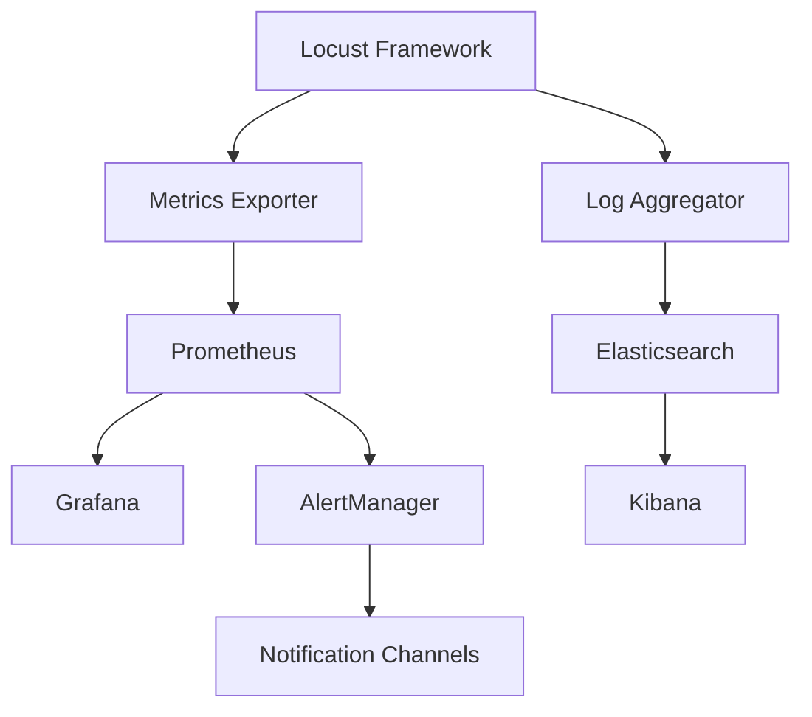

# 监控配置

本文档详细介绍如何配置Locust性能测试框架的监控系统，包括指标收集、告警设置和可视化配置。

## 🎯 监控架构

### 监控组件

```yaml
# monitoring/architecture.yml
monitoring_stack:
  metrics_collection:
    - prometheus      # 指标收集
    - node_exporter   # 系统指标
    - locust_exporter # Locust指标

  visualization:
    - grafana         # 仪表板
    - kibana          # 日志分析

  alerting:
    - alertmanager    # 告警管理
    - webhook_alerts  # 自定义告警

  storage:
    - prometheus_tsdb # 时序数据库
    - elasticsearch   # 日志存储
```

### 数据流



## 📊 Prometheus配置

### 1. 基础配置

```yaml
# prometheus/prometheus.yml
global:
  scrape_interval: 15s
  evaluation_interval: 15s
  external_labels:
    cluster: 'locust-cluster'
    environment: 'production'

rule_files:
  - "rules/*.yml"

scrape_configs:
  # Locust Master节点
  - job_name: 'locust-master'
    static_configs:
      - targets: ['locust-master:8089']
    metrics_path: '/stats/requests'
    params:
      format: ['prometheus']
    scrape_interval: 30s
    scrape_timeout: 10s

  # Locust Worker节点
  - job_name: 'locust-workers'
    static_configs:
      - targets:
        - 'locust-worker-1:8089'
        - 'locust-worker-2:8089'
        - 'locust-worker-3:8089'
    metrics_path: '/stats/requests'
    params:
      format: ['prometheus']
    scrape_interval: 30s

  # 系统指标
  - job_name: 'node-exporter'
    static_configs:
      - targets:
        - 'locust-master:9100'
        - 'locust-worker-1:9100'
        - 'locust-worker-2:9100'
        - 'locust-worker-3:9100'
    scrape_interval: 15s

  # 应用指标
  - job_name: 'locust-app-metrics'
    static_configs:
      - targets: ['locust-master:9090']
    metrics_path: '/metrics'
    scrape_interval: 15s

alerting:
  alertmanagers:
    - static_configs:
        - targets:
          - alertmanager:9093
      timeout: 10s
      api_version: v2
```

### 2. 自定义指标导出器

```python
# monitoring/locust_exporter.py
from prometheus_client import start_http_server, Gauge, Counter, Histogram
from locust import events
import time
import threading

class LocustMetricsExporter:
    """Locust指标导出器"""

    def __init__(self, port=9090):
        self.port = port

        # 定义指标
        self.request_total = Counter(
            'locust_requests_total',
            'Total number of requests',
            ['method', 'name', 'status']
        )

        self.request_duration = Histogram(
            'locust_request_duration_seconds',
            'Request duration in seconds',
            ['method', 'name'],
            buckets=[0.1, 0.25, 0.5, 1.0, 2.5, 5.0, 10.0]
        )

        self.current_users = Gauge(
            'locust_current_users',
            'Current number of users'
        )

        self.rps = Gauge(
            'locust_requests_per_second',
            'Current requests per second'
        )

        self.error_rate = Gauge(
            'locust_error_rate_percent',
            'Current error rate percentage'
        )

        self.response_time_percentiles = Gauge(
            'locust_response_time_percentile_seconds',
            'Response time percentiles',
            ['percentile']
        )

        # 业务指标
        self.business_metrics = {}

        # 注册事件监听器
        self.register_listeners()

    def register_listeners(self):
        """注册Locust事件监听器"""

        @events.request.add_listener
        def on_request(request_type, name, response_time, response_length, exception, context, **kwargs):
            # 记录请求总数
            status = "success" if not exception else "failure"
            self.request_total.labels(
                method=request_type,
                name=name,
                status=status
            ).inc()

            # 记录请求耗时
            if not exception:
                self.request_duration.labels(
                    method=request_type,
                    name=name
                ).observe(response_time / 1000.0)  # 转换为秒

        @events.user_count_changed.add_listener
        def on_user_count_changed(user_count, **kwargs):
            self.current_users.set(user_count)

        # 定期更新统计指标
        def update_stats():
            while True:
                try:
                    from locust import stats
                    total_stats = stats.total

                    if total_stats.num_requests > 0:
                        # 更新RPS
                        self.rps.set(total_stats.current_rps)

                        # 更新错误率
                        error_rate = (total_stats.num_failures / total_stats.num_requests) * 100
                        self.error_rate.set(error_rate)

                        # 更新响应时间百分位数
                        self.response_time_percentiles.labels(percentile="50").set(
                            total_stats.get_response_time_percentile(0.5) / 1000.0
                        )
                        self.response_time_percentiles.labels(percentile="95").set(
                            total_stats.get_response_time_percentile(0.95) / 1000.0
                        )
                        self.response_time_percentiles.labels(percentile="99").set(
                            total_stats.get_response_time_percentile(0.99) / 1000.0
                        )

                except Exception as e:
                    print(f"Error updating stats: {e}")

                time.sleep(5)  # 每5秒更新一次

        # 启动统计更新线程
        stats_thread = threading.Thread(target=update_stats, daemon=True)
        stats_thread.start()

    def add_business_metric(self, name: str, description: str, metric_type: str = 'gauge', labels: list = None):
        """添加业务指标"""
        labels = labels or []

        if metric_type == 'gauge':
            metric = Gauge(name, description, labels)
        elif metric_type == 'counter':
            metric = Counter(name, description, labels)
        elif metric_type == 'histogram':
            metric = Histogram(name, description, labels)
        else:
            raise ValueError(f"Unsupported metric type: {metric_type}")

        self.business_metrics[name] = metric
        return metric

    def start_server(self):
        """启动指标服务器"""
        start_http_server(self.port)
        print(f"Metrics server started on port {self.port}")

# 使用指标导出器
exporter = LocustMetricsExporter()

@events.init.add_listener
def on_locust_init(environment, **kwargs):
    exporter.start_server()

    # 添加自定义业务指标
    login_success_metric = exporter.add_business_metric(
        'locust_login_success_total',
        'Total successful logins',
        'counter',
        ['user_type']
    )

    order_processing_time = exporter.add_business_metric(
        'locust_order_processing_seconds',
        'Order processing time',
        'histogram',
        ['order_type']
    )
```

## 📈 Grafana配置

### 1. 数据源配置

```yaml
# grafana/datasources.yml
apiVersion: 1

datasources:
  - name: Prometheus
    type: prometheus
    access: proxy
    url: http://prometheus:9090
    isDefault: true
    editable: true

  - name: Elasticsearch
    type: elasticsearch
    access: proxy
    url: http://elasticsearch:9200
    database: "locust-logs-*"
    interval: Daily
    timeField: "@timestamp"
```

### 2. 仪表板配置

```json
{
  "dashboard": {
    "id": null,
    "title": "Locust Performance Dashboard",
    "tags": ["locust", "performance"],
    "timezone": "browser",
    "panels": [
      {
        "id": 1,
        "title": "Request Rate",
        "type": "graph",
        "targets": [
          {
            "expr": "rate(locust_requests_total[5m])",
            "legendFormat": "{{method}} {{name}}",
            "refId": "A"
          }
        ],
        "yAxes": [
          {
            "label": "Requests/sec",
            "min": 0
          }
        ],
        "gridPos": {"h": 8, "w": 12, "x": 0, "y": 0}
      },
      {
        "id": 2,
        "title": "Response Time",
        "type": "graph",
        "targets": [
          {
            "expr": "locust_response_time_percentile_seconds{percentile=\"50\"}",
            "legendFormat": "50th percentile",
            "refId": "A"
          },
          {
            "expr": "locust_response_time_percentile_seconds{percentile=\"95\"}",
            "legendFormat": "95th percentile",
            "refId": "B"
          },
          {
            "expr": "locust_response_time_percentile_seconds{percentile=\"99\"}",
            "legendFormat": "99th percentile",
            "refId": "C"
          }
        ],
        "yAxes": [
          {
            "label": "Seconds",
            "min": 0
          }
        ],
        "gridPos": {"h": 8, "w": 12, "x": 12, "y": 0}
      },
      {
        "id": 3,
        "title": "Error Rate",
        "type": "singlestat",
        "targets": [
          {
            "expr": "locust_error_rate_percent",
            "refId": "A"
          }
        ],
        "valueName": "current",
        "format": "percent",
        "thresholds": "5,10",
        "colorBackground": true,
        "gridPos": {"h": 4, "w": 6, "x": 0, "y": 8}
      },
      {
        "id": 4,
        "title": "Current Users",
        "type": "singlestat",
        "targets": [
          {
            "expr": "locust_current_users",
            "refId": "A"
          }
        ],
        "valueName": "current",
        "format": "short",
        "gridPos": {"h": 4, "w": 6, "x": 6, "y": 8}
      },
      {
        "id": 5,
        "title": "System Resources",
        "type": "graph",
        "targets": [
          {
            "expr": "100 - (avg by (instance) (rate(node_cpu_seconds_total{mode=\"idle\"}[5m])) * 100)",
            "legendFormat": "CPU Usage - {{instance}}",
            "refId": "A"
          },
          {
            "expr": "(1 - (node_memory_MemAvailable_bytes / node_memory_MemTotal_bytes)) * 100",
            "legendFormat": "Memory Usage - {{instance}}",
            "refId": "B"
          }
        ],
        "yAxes": [
          {
            "label": "Percent",
            "min": 0,
            "max": 100
          }
        ],
        "gridPos": {"h": 8, "w": 12, "x": 12, "y": 8}
      }
    ],
    "time": {
      "from": "now-1h",
      "to": "now"
    },
    "refresh": "5s"
  }
}
```

### 3. 告警规则

```yaml
# grafana/alerts.yml
groups:
  - name: locust_alerts
    rules:
      - alert: HighErrorRate
        expr: locust_error_rate_percent > 5
        for: 2m
        labels:
          severity: warning
          service: locust
        annotations:
          summary: "High error rate detected"
          description: "Error rate is {{ $value }}% for more than 2 minutes"

      - alert: HighResponseTime
        expr: locust_response_time_percentile_seconds{percentile="95"} > 2
        for: 5m
        labels:
          severity: warning
          service: locust
        annotations:
          summary: "High response time detected"
          description: "95th percentile response time is {{ $value }}s"

      - alert: LowThroughput
        expr: locust_requests_per_second < 50
        for: 3m
        labels:
          severity: warning
          service: locust
        annotations:
          summary: "Low throughput detected"
          description: "Current RPS is {{ $value }}"

      - alert: SystemResourceHigh
        expr: (100 - (avg by (instance) (rate(node_cpu_seconds_total{mode="idle"}[5m])) * 100)) > 80
        for: 5m
        labels:
          severity: critical
          service: system
        annotations:
          summary: "High CPU usage on {{ $labels.instance }}"
          description: "CPU usage is {{ $value }}%"
```

## 🚨 AlertManager配置

### 1. 基础配置

```yaml
# alertmanager/alertmanager.yml
global:
  smtp_smarthost: 'smtp.gmail.com:587'
  smtp_from: 'alerts@yourcompany.com'
  smtp_auth_username: 'alerts@yourcompany.com'
  smtp_auth_password: 'your-app-password'

route:
  group_by: ['alertname', 'cluster', 'service']
  group_wait: 10s
  group_interval: 10s
  repeat_interval: 1h
  receiver: 'default-receiver'
  routes:
    - match:
        severity: critical
      receiver: 'critical-alerts'
      group_wait: 5s
      repeat_interval: 30m
    - match:
        severity: warning
      receiver: 'warning-alerts'
      repeat_interval: 2h

receivers:
  - name: 'default-receiver'
    email_configs:
      - to: 'team@yourcompany.com'
        subject: 'Locust Alert: {{ .GroupLabels.alertname }}'
        body: |
          {{ range .Alerts }}
          Alert: {{ .Annotations.summary }}
          Description: {{ .Annotations.description }}
          Labels: {{ range .Labels.SortedPairs }}{{ .Name }}={{ .Value }} {{ end }}
          {{ end }}

  - name: 'critical-alerts'
    email_configs:
      - to: 'oncall@yourcompany.com'
        subject: 'CRITICAL: Locust Alert'
        body: |
          CRITICAL ALERT TRIGGERED

          {{ range .Alerts }}
          Alert: {{ .Annotations.summary }}
          Description: {{ .Annotations.description }}
          Severity: {{ .Labels.severity }}
          Service: {{ .Labels.service }}
          Time: {{ .StartsAt }}
          {{ end }}

    slack_configs:
      - api_url: 'https://hooks.slack.com/services/YOUR/SLACK/WEBHOOK'
        channel: '#alerts'
        title: 'Critical Locust Alert'
        text: |
          {{ range .Alerts }}
          *{{ .Annotations.summary }}*
          {{ .Annotations.description }}
          {{ end }}
        color: 'danger'

  - name: 'warning-alerts'
    slack_configs:
      - api_url: 'https://hooks.slack.com/services/YOUR/SLACK/WEBHOOK'
        channel: '#monitoring'
        title: 'Locust Warning'
        text: |
          {{ range .Alerts }}
          {{ .Annotations.summary }}
          {{ .Annotations.description }}
          {{ end }}
        color: 'warning'

inhibit_rules:
  - source_match:
      severity: 'critical'
    target_match:
      severity: 'warning'
    equal: ['alertname', 'cluster', 'service']
```

### 2. 自定义通知渠道

```python
# monitoring/notification_manager.py
import requests
import json
from typing import Dict, List
from datetime import datetime

class NotificationManager:
    """通知管理器"""

    def __init__(self, config: Dict):
        self.config = config
        self.channels = {
            'slack': self.send_slack_notification,
            'dingtalk': self.send_dingtalk_notification,
            'feishu': self.send_feishu_notification,
            'email': self.send_email_notification,
            'webhook': self.send_webhook_notification
        }

    def send_alert(self, alert_data: Dict, channels: List[str] = None):
        """发送告警"""
        channels = channels or self.config.get('default_channels', ['slack'])

        for channel in channels:
            if channel in self.channels:
                try:
                    self.channels[channel](alert_data)
                    print(f"Alert sent to {channel}")
                except Exception as e:
                    print(f"Failed to send alert to {channel}: {e}")

    def send_slack_notification(self, alert_data: Dict):
        """发送Slack通知"""
        webhook_url = self.config['slack']['webhook_url']

        color = 'danger' if alert_data['severity'] == 'critical' else 'warning'

        payload = {
            "attachments": [
                {
                    "color": color,
                    "title": f"Locust Alert: {alert_data['alert_name']}",
                    "text": alert_data['description'],
                    "fields": [
                        {
                            "title": "Severity",
                            "value": alert_data['severity'],
                            "short": True
                        },
                        {
                            "title": "Service",
                            "value": alert_data.get('service', 'locust'),
                            "short": True
                        },
                        {
                            "title": "Time",
                            "value": datetime.now().strftime("%Y-%m-%d %H:%M:%S"),
                            "short": True
                        }
                    ]
                }
            ]
        }

        response = requests.post(webhook_url, json=payload, timeout=10)
        response.raise_for_status()

    def send_dingtalk_notification(self, alert_data: Dict):
        """发送钉钉通知"""
        webhook_url = self.config['dingtalk']['webhook_url']

        message = f"""
        🚨 Locust性能告警

        **告警名称**: {alert_data['alert_name']}
        **严重程度**: {alert_data['severity']}
        **描述**: {alert_data['description']}
        **时间**: {datetime.now().strftime("%Y-%m-%d %H:%M:%S")}
        """

        payload = {
            "msgtype": "markdown",
            "markdown": {
                "title": "Locust性能告警",
                "text": message
            }
        }

        response = requests.post(webhook_url, json=payload, timeout=10)
        response.raise_for_status()

    def send_feishu_notification(self, alert_data: Dict):
        """发送飞书通知"""
        webhook_url = self.config['feishu']['webhook_url']

        color = "red" if alert_data['severity'] == 'critical' else "orange"

        payload = {
            "msg_type": "interactive",
            "card": {
                "elements": [
                    {
                        "tag": "div",
                        "text": {
                            "content": f"**{alert_data['alert_name']}**\n{alert_data['description']}",
                            "tag": "lark_md"
                        }
                    },
                    {
                        "tag": "div",
                        "fields": [
                            {
                                "is_short": True,
                                "text": {
                                    "content": f"**严重程度**\n{alert_data['severity']}",
                                    "tag": "lark_md"
                                }
                            },
                            {
                                "is_short": True,
                                "text": {
                                    "content": f"**时间**\n{datetime.now().strftime('%Y-%m-%d %H:%M:%S')}",
                                    "tag": "lark_md"
                                }
                            }
                        ]
                    }
                ],
                "header": {
                    "title": {
                        "content": "Locust性能告警",
                        "tag": "plain_text"
                    },
                    "template": color
                }
            }
        }

        response = requests.post(webhook_url, json=payload, timeout=10)
        response.raise_for_status()

    def send_email_notification(self, alert_data: Dict):
        """发送邮件通知"""
        # 实现邮件发送逻辑
        pass

    def send_webhook_notification(self, alert_data: Dict):
        """发送Webhook通知"""
        webhook_url = self.config['webhook']['url']

        payload = {
            "alert_name": alert_data['alert_name'],
            "severity": alert_data['severity'],
            "description": alert_data['description'],
            "timestamp": datetime.now().isoformat(),
            "source": "locust-framework"
        }

        response = requests.post(webhook_url, json=payload, timeout=10)
        response.raise_for_status()

# 配置示例
notification_config = {
    "default_channels": ["slack", "dingtalk"],
    "slack": {
        "webhook_url": "https://hooks.slack.com/services/YOUR/SLACK/WEBHOOK"
    },
    "dingtalk": {
        "webhook_url": "https://oapi.dingtalk.com/robot/send?access_token=YOUR_TOKEN"
    },
    "feishu": {
        "webhook_url": "https://open.feishu.cn/open-apis/bot/v2/hook/YOUR_HOOK"
    },
    "webhook": {
        "url": "https://your-api.com/alerts"
    }
}

notification_manager = NotificationManager(notification_config)
```

## 📋 日志配置

### 1. 日志聚合

```yaml
# logging/filebeat.yml
filebeat.inputs:
- type: log
  enabled: true
  paths:
    - /app/logs/*.log
  fields:
    service: locust
    environment: production
  fields_under_root: true
  multiline.pattern: '^\d{4}-\d{2}-\d{2}'
  multiline.negate: true
  multiline.match: after

output.elasticsearch:
  hosts: ["elasticsearch:9200"]
  index: "locust-logs-%{+yyyy.MM.dd}"
  template.name: "locust-logs"
  template.pattern: "locust-logs-*"

processors:
- add_host_metadata:
    when.not.contains.tags: forwarded
- add_docker_metadata: ~
```

### 2. 日志格式化

```python
# logging/log_formatter.py
import logging
import json
from datetime import datetime

class StructuredFormatter(logging.Formatter):
    """结构化日志格式化器"""

    def format(self, record):
        log_entry = {
            "timestamp": datetime.utcnow().isoformat(),
            "level": record.levelname,
            "logger": record.name,
            "message": record.getMessage(),
            "module": record.module,
            "function": record.funcName,
            "line": record.lineno
        }

        # 添加异常信息
        if record.exc_info:
            log_entry["exception"] = self.formatException(record.exc_info)

        # 添加自定义字段
        if hasattr(record, 'user_id'):
            log_entry["user_id"] = record.user_id
        if hasattr(record, 'request_id'):
            log_entry["request_id"] = record.request_id
        if hasattr(record, 'test_name'):
            log_entry["test_name"] = record.test_name

        return json.dumps(log_entry)

# 配置日志
def setup_logging():
    """设置日志配置"""
    logger = logging.getLogger()
    logger.setLevel(logging.INFO)

    # 控制台处理器
    console_handler = logging.StreamHandler()
    console_handler.setFormatter(StructuredFormatter())
    logger.addHandler(console_handler)

    # 文件处理器
    file_handler = logging.FileHandler('/app/logs/locust.log')
    file_handler.setFormatter(StructuredFormatter())
    logger.addHandler(file_handler)

    return logger
```

## 🔧 部署配置

### Docker Compose监控栈

```yaml
# docker-compose.monitoring.yml
version: '3.8'

services:
  prometheus:
    image: prom/prometheus:latest
    container_name: prometheus
    ports:
      - "9090:9090"
    volumes:
      - ./prometheus:/etc/prometheus
      - prometheus-data:/prometheus
    command:
      - '--config.file=/etc/prometheus/prometheus.yml'
      - '--storage.tsdb.path=/prometheus'
      - '--web.console.libraries=/etc/prometheus/console_libraries'
      - '--web.console.templates=/etc/prometheus/consoles'
      - '--storage.tsdb.retention.time=200h'
      - '--web.enable-lifecycle'
    networks:
      - monitoring

  grafana:
    image: grafana/grafana:latest
    container_name: grafana
    ports:
      - "3000:3000"
    volumes:
      - grafana-data:/var/lib/grafana
      - ./grafana/provisioning:/etc/grafana/provisioning
    environment:
      - GF_SECURITY_ADMIN_PASSWORD=admin123
      - GF_USERS_ALLOW_SIGN_UP=false
    networks:
      - monitoring

  alertmanager:
    image: prom/alertmanager:latest
    container_name: alertmanager
    ports:
      - "9093:9093"
    volumes:
      - ./alertmanager:/etc/alertmanager
    command:
      - '--config.file=/etc/alertmanager/alertmanager.yml'
      - '--storage.path=/alertmanager'
      - '--web.external-url=http://localhost:9093'
    networks:
      - monitoring

  node-exporter:
    image: prom/node-exporter:latest
    container_name: node-exporter
    ports:
      - "9100:9100"
    volumes:
      - /proc:/host/proc:ro
      - /sys:/host/sys:ro
      - /:/rootfs:ro
    command:
      - '--path.procfs=/host/proc'
      - '--path.rootfs=/rootfs'
      - '--path.sysfs=/host/sys'
      - '--collector.filesystem.ignored-mount-points=^/(sys|proc|dev|host|etc)($$|/)'
    networks:
      - monitoring

networks:
  monitoring:
    driver: bridge

volumes:
  prometheus-data:
  grafana-data:
```

## 🎉 总结

完整的监控配置包括：

1. **指标收集**: Prometheus + 自定义导出器
2. **可视化**: Grafana仪表板和图表
3. **告警**: AlertManager + 多渠道通知
4. **日志**: 结构化日志 + ELK栈
5. **部署**: Docker化监控栈

## 📚 相关文档

- [生产环境配置](production.md) - 生产部署配置
- [通知配置](notification-config.md) - 通知系统配置
- [故障排除](../examples/troubleshooting.md) - 监控问题排查
- [最佳实践](../examples/best-practices.md) - 监控最佳实践
