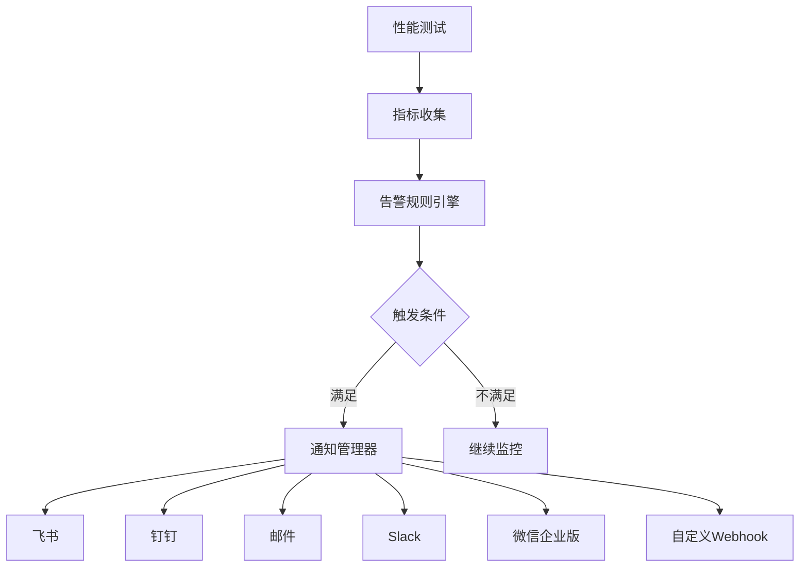

# 通知配置

本文档详细介绍如何配置Locust性能测试框架的通知系统，包括多种通知渠道的设置、告警规则配置和消息模板定制。

## 🎯 通知架构

### 通知流程



### 支持的通知渠道

```yaml
# notification/channels.yml
supported_channels:
  instant_messaging:
    - feishu          # 飞书
    - dingtalk        # 钉钉
    - slack           # Slack
    - wechat_work     # 企业微信

  email:
    - smtp            # SMTP邮件
    - sendgrid        # SendGrid
    - ses             # AWS SES

  webhook:
    - custom_webhook  # 自定义Webhook
    - teams           # Microsoft Teams
    - discord         # Discord

  sms:
    - twilio          # Twilio短信
    - aliyun_sms      # 阿里云短信
```

## 📱 即时通讯配置

### 1. 飞书配置

```yaml
# config/notifications.yml
feishu:
  enabled: true
  webhook_url: "https://open.feishu.cn/open-apis/bot/v2/hook/YOUR_WEBHOOK_TOKEN"
  secret: "your_secret_key"  # 可选，用于签名验证

  # 消息模板配置
  templates:
    alert:
      title: "🚨 Locust性能告警"
      color: "red"  # red, orange, blue, green, grey
    warning:
      title: "⚠️ Locust性能警告"
      color: "orange"
    info:
      title: "ℹ️ Locust测试信息"
      color: "blue"
    success:
      title: "✅ Locust测试完成"
      color: "green"

  # 发送配置
  settings:
    retry_times: 3
    timeout: 10
    rate_limit: 20  # 每分钟最大消息数
```

#### 飞书通知实现

```python
# src/plugins/notification/feishu_notifier.py
import requests
import json
import time
import hashlib
import hmac
import base64
from typing import Dict, Optional
from datetime import datetime

class FeishuNotifier:
    """飞书通知器"""

    def __init__(self, webhook_url: str, secret: Optional[str] = None):
        self.webhook_url = webhook_url
        self.secret = secret
        self.rate_limiter = {}

    def send_message(self, message_type: str, content: Dict, **kwargs) -> bool:
        """发送消息"""
        try:
            # 检查频率限制
            if not self._check_rate_limit():
                print("Rate limit exceeded, message skipped")
                return False

            # 构建消息
            payload = self._build_payload(message_type, content, **kwargs)

            # 添加签名（如果配置了secret）
            if self.secret:
                payload = self._add_signature(payload)

            # 发送请求
            response = requests.post(
                self.webhook_url,
                json=payload,
                timeout=10,
                headers={'Content-Type': 'application/json'}
            )

            response.raise_for_status()
            result = response.json()

            if result.get('code') == 0:
                print("Feishu message sent successfully")
                return True
            else:
                print(f"Feishu API error: {result.get('msg', 'Unknown error')}")
                return False

        except Exception as e:
            print(f"Failed to send Feishu message: {e}")
            return False

    def _build_payload(self, message_type: str, content: Dict, **kwargs) -> Dict:
        """构建消息载荷"""
        if message_type == "text":
            return {
                "msg_type": "text",
                "content": {
                    "text": content.get("text", "")
                }
            }

        elif message_type == "rich_text":
            return {
                "msg_type": "post",
                "content": {
                    "post": {
                        "zh_cn": {
                            "title": content.get("title", ""),
                            "content": content.get("content", [])
                        }
                    }
                }
            }

        elif message_type == "card":
            return {
                "msg_type": "interactive",
                "card": content
            }

        else:
            raise ValueError(f"Unsupported message type: {message_type}")

    def _add_signature(self, payload: Dict) -> Dict:
        """添加签名验证"""
        timestamp = str(int(time.time()))

        # 构建签名字符串
        string_to_sign = f"{timestamp}\n{self.secret}"

        # 计算签名
        hmac_code = hmac.new(
            string_to_sign.encode("utf-8"),
            digestmod=hashlib.sha256
        ).digest()
        sign = base64.b64encode(hmac_code).decode('utf-8')

        # 添加到载荷
        payload["timestamp"] = timestamp
        payload["sign"] = sign

        return payload

    def _check_rate_limit(self) -> bool:
        """检查频率限制"""
        current_minute = int(time.time() // 60)

        if current_minute not in self.rate_limiter:
            self.rate_limiter = {current_minute: 1}
            return True

        if self.rate_limiter[current_minute] < 20:  # 每分钟最多20条
            self.rate_limiter[current_minute] += 1
            return True

        return False

    def send_alert(self, alert_data: Dict) -> bool:
        """发送告警消息"""
        severity_colors = {
            "critical": "red",
            "warning": "orange",
            "info": "blue"
        }

        severity_icons = {
            "critical": "🚨",
            "warning": "⚠️",
            "info": "ℹ️"
        }

        severity = alert_data.get("severity", "info")
        color = severity_colors.get(severity, "grey")
        icon = severity_icons.get(severity, "📊")

        card_content = {
            "elements": [
                {
                    "tag": "div",
                    "text": {
                        "content": f"**{alert_data.get('title', '性能告警')}**\n{alert_data.get('description', '')}",
                        "tag": "lark_md"
                    }
                },
                {
                    "tag": "div",
                    "fields": [
                        {
                            "is_short": True,
                            "text": {
                                "content": f"**严重程度**\n{severity.upper()}",
                                "tag": "lark_md"
                            }
                        },
                        {
                            "is_short": True,
                            "text": {
                                "content": f"**时间**\n{datetime.now().strftime('%Y-%m-%d %H:%M:%S')}",
                                "tag": "lark_md"
                            }
                        }
                    ]
                }
            ],
            "header": {
                "title": {
                    "content": f"{icon} Locust性能告警",
                    "tag": "plain_text"
                },
                "template": color
            }
        }

        # 添加指标信息
        if "metrics" in alert_data:
            metrics_text = []
            for key, value in alert_data["metrics"].items():
                metrics_text.append(f"**{key}**: {value}")

            card_content["elements"].append({
                "tag": "div",
                "text": {
                    "content": "\n".join(metrics_text),
                    "tag": "lark_md"
                }
            })

        # 添加操作按钮
        if alert_data.get("dashboard_url"):
            card_content["elements"].append({
                "tag": "action",
                "actions": [
                    {
                        "tag": "button",
                        "text": {
                            "content": "查看仪表板",
                            "tag": "plain_text"
                        },
                        "url": alert_data["dashboard_url"],
                        "type": "primary"
                    }
                ]
            })

        return self.send_message("card", card_content)
```

### 2. 钉钉配置

```yaml
# config/notifications.yml
dingtalk:
  enabled: true
  webhook_url: "https://oapi.dingtalk.com/robot/send?access_token=YOUR_ACCESS_TOKEN"
  secret: "your_secret_key"  # 可选，用于签名验证

  # 消息配置
  settings:
    at_all: false
    at_mobiles: []  # @指定手机号
    at_user_ids: []  # @指定用户ID
    retry_times: 3
    timeout: 10
```

#### 钉钉通知实现

```python
# src/plugins/notification/dingtalk_notifier.py
import requests
import json
import time
import hashlib
import hmac
import base64
import urllib.parse
from typing import Dict, List, Optional

class DingTalkNotifier:
    """钉钉通知器"""

    def __init__(self, webhook_url: str, secret: Optional[str] = None):
        self.webhook_url = webhook_url
        self.secret = secret

    def send_message(self, msg_type: str, content: Dict, at_mobiles: List[str] = None, at_all: bool = False) -> bool:
        """发送消息"""
        try:
            # 构建消息载荷
            payload = {
                "msgtype": msg_type,
                msg_type: content,
                "at": {
                    "atMobiles": at_mobiles or [],
                    "isAtAll": at_all
                }
            }

            # 添加签名
            url = self._add_signature() if self.secret else self.webhook_url

            # 发送请求
            response = requests.post(
                url,
                json=payload,
                timeout=10,
                headers={'Content-Type': 'application/json'}
            )

            response.raise_for_status()
            result = response.json()

            if result.get('errcode') == 0:
                print("DingTalk message sent successfully")
                return True
            else:
                print(f"DingTalk API error: {result.get('errmsg', 'Unknown error')}")
                return False

        except Exception as e:
            print(f"Failed to send DingTalk message: {e}")
            return False

    def _add_signature(self) -> str:
        """添加签名验证"""
        timestamp = str(round(time.time() * 1000))
        secret_enc = self.secret.encode('utf-8')
        string_to_sign = f'{timestamp}\n{self.secret}'
        string_to_sign_enc = string_to_sign.encode('utf-8')
        hmac_code = hmac.new(secret_enc, string_to_sign_enc, digestmod=hashlib.sha256).digest()
        sign = urllib.parse.quote_plus(base64.b64encode(hmac_code))

        return f"{self.webhook_url}&timestamp={timestamp}&sign={sign}"

    def send_alert(self, alert_data: Dict) -> bool:
        """发送告警消息"""
        severity_icons = {
            "critical": "🚨",
            "warning": "⚠️",
            "info": "ℹ️"
        }

        severity = alert_data.get("severity", "info")
        icon = severity_icons.get(severity, "📊")

        # 构建Markdown消息
        markdown_content = f"""
# {icon} Locust性能告警

**告警名称**: {alert_data.get('title', '性能告警')}

**严重程度**: {severity.upper()}

**描述**: {alert_data.get('description', '')}

**时间**: {datetime.now().strftime('%Y-%m-%d %H:%M:%S')}
"""

        # 添加指标信息
        if "metrics" in alert_data:
            markdown_content += "\n**关键指标**:\n"
            for key, value in alert_data["metrics"].items():
                markdown_content += f"- {key}: {value}\n"

        # 添加仪表板链接
        if alert_data.get("dashboard_url"):
            markdown_content += f"\n[查看详细仪表板]({alert_data['dashboard_url']})"

        content = {
            "title": f"{icon} Locust性能告警",
            "text": markdown_content
        }

        # 根据严重程度决定是否@所有人
        at_all = severity == "critical"

        return self.send_message("markdown", content, at_all=at_all)
```

### 3. Slack配置

```yaml
# config/notifications.yml
slack:
  enabled: true
  webhook_url: "https://hooks.slack.com/services/YOUR/SLACK/WEBHOOK"

  # 频道配置
  channels:
    alerts: "#alerts"
    warnings: "#monitoring"
    info: "#general"

  # 消息配置
  settings:
    username: "Locust Bot"
    icon_emoji: ":robot_face:"
    retry_times: 3
    timeout: 10
```

#### Slack通知实现

```python
# src/plugins/notification/slack_notifier.py
import requests
import json
from typing import Dict, List, Optional
from datetime import datetime

class SlackNotifier:
    """Slack通知器"""

    def __init__(self, webhook_url: str, default_channel: str = "#general"):
        self.webhook_url = webhook_url
        self.default_channel = default_channel

    def send_message(self, text: str, channel: str = None, attachments: List[Dict] = None, **kwargs) -> bool:
        """发送消息"""
        try:
            payload = {
                "text": text,
                "channel": channel or self.default_channel,
                "username": kwargs.get("username", "Locust Bot"),
                "icon_emoji": kwargs.get("icon_emoji", ":robot_face:")
            }

            if attachments:
                payload["attachments"] = attachments

            response = requests.post(
                self.webhook_url,
                json=payload,
                timeout=10
            )

            response.raise_for_status()

            if response.text == "ok":
                print("Slack message sent successfully")
                return True
            else:
                print(f"Slack API error: {response.text}")
                return False

        except Exception as e:
            print(f"Failed to send Slack message: {e}")
            return False

    def send_alert(self, alert_data: Dict) -> bool:
        """发送告警消息"""
        severity_colors = {
            "critical": "danger",
            "warning": "warning",
            "info": "good"
        }

        severity_icons = {
            "critical": ":rotating_light:",
            "warning": ":warning:",
            "info": ":information_source:"
        }

        severity = alert_data.get("severity", "info")
        color = severity_colors.get(severity, "good")
        icon = severity_icons.get(severity, ":chart_with_upwards_trend:")

        # 选择频道
        channel_map = {
            "critical": "#alerts",
            "warning": "#monitoring",
            "info": "#general"
        }
        channel = channel_map.get(severity, self.default_channel)

        # 构建附件
        attachment = {
            "color": color,
            "title": f"{icon} Locust性能告警",
            "text": alert_data.get("description", ""),
            "fields": [
                {
                    "title": "告警名称",
                    "value": alert_data.get("title", "性能告警"),
                    "short": True
                },
                {
                    "title": "严重程度",
                    "value": severity.upper(),
                    "short": True
                },
                {
                    "title": "时间",
                    "value": datetime.now().strftime("%Y-%m-%d %H:%M:%S"),
                    "short": True
                }
            ],
            "footer": "Locust Framework",
            "ts": int(datetime.now().timestamp())
        }

        # 添加指标字段
        if "metrics" in alert_data:
            for key, value in alert_data["metrics"].items():
                attachment["fields"].append({
                    "title": key,
                    "value": str(value),
                    "short": True
                })

        # 添加操作按钮
        if alert_data.get("dashboard_url"):
            attachment["actions"] = [
                {
                    "type": "button",
                    "text": "查看仪表板",
                    "url": alert_data["dashboard_url"],
                    "style": "primary"
                }
            ]

        return self.send_message(
            text=f"{icon} 检测到性能告警",
            channel=channel,
            attachments=[attachment]
        )
```

## 📧 邮件配置

### 1. SMTP配置

```yaml
# config/notifications.yml
email:
  enabled: true
  smtp:
    host: "smtp.gmail.com"
    port: 587
    use_tls: true
    username: "your-email@gmail.com"
    password: "your-app-password"

  # 发件人配置
  sender:
    name: "Locust Performance Monitor"
    email: "noreply@yourcompany.com"

  # 收件人配置
  recipients:
    critical: ["oncall@yourcompany.com", "team-lead@yourcompany.com"]
    warning: ["team@yourcompany.com"]
    info: ["monitoring@yourcompany.com"]

  # 模板配置
  templates:
    subject: "[{severity}] Locust Alert: {title}"
    html_template: "email_alert.html"
    text_template: "email_alert.txt"
```

#### 邮件通知实现

```python
# src/plugins/notification/email_notifier.py
import smtplib
import ssl
from email.mime.text import MIMEText
from email.mime.multipart import MIMEMultipart
from email.mime.base import MIMEBase
from email import encoders
from typing import Dict, List, Optional
from datetime import datetime
import jinja2

class EmailNotifier:
    """邮件通知器"""

    def __init__(self, smtp_config: Dict):
        self.smtp_config = smtp_config
        self.template_env = jinja2.Environment(
            loader=jinja2.FileSystemLoader('templates/email')
        )

    def send_email(self, to_emails: List[str], subject: str, html_content: str, text_content: str = None) -> bool:
        """发送邮件"""
        try:
            # 创建消息
            message = MIMEMultipart("alternative")
            message["Subject"] = subject
            message["From"] = self.smtp_config["sender"]["email"]
            message["To"] = ", ".join(to_emails)

            # 添加文本内容
            if text_content:
                text_part = MIMEText(text_content, "plain")
                message.attach(text_part)

            # 添加HTML内容
            html_part = MIMEText(html_content, "html")
            message.attach(html_part)

            # 发送邮件
            context = ssl.create_default_context()

            with smtplib.SMTP(self.smtp_config["host"], self.smtp_config["port"]) as server:
                if self.smtp_config.get("use_tls"):
                    server.starttls(context=context)

                server.login(
                    self.smtp_config["username"],
                    self.smtp_config["password"]
                )

                server.sendmail(
                    self.smtp_config["sender"]["email"],
                    to_emails,
                    message.as_string()
                )

            print(f"Email sent successfully to {', '.join(to_emails)}")
            return True

        except Exception as e:
            print(f"Failed to send email: {e}")
            return False

    def send_alert(self, alert_data: Dict) -> bool:
        """发送告警邮件"""
        severity = alert_data.get("severity", "info")

        # 获取收件人列表
        recipients = self.smtp_config["recipients"].get(severity, [])
        if not recipients:
            print(f"No recipients configured for severity: {severity}")
            return False

        # 生成邮件内容
        subject = self.smtp_config["templates"]["subject"].format(
            severity=severity.upper(),
            title=alert_data.get("title", "性能告警")
        )

        # 渲染HTML模板
        html_template = self.template_env.get_template(
            self.smtp_config["templates"]["html_template"]
        )
        html_content = html_template.render(
            alert_data=alert_data,
            timestamp=datetime.now().strftime("%Y-%m-%d %H:%M:%S")
        )

        # 渲染文本模板
        text_template = self.template_env.get_template(
            self.smtp_config["templates"]["text_template"]
        )
        text_content = text_template.render(
            alert_data=alert_data,
            timestamp=datetime.now().strftime("%Y-%m-%d %H:%M:%S")
        )

        return self.send_email(recipients, subject, html_content, text_content)
```

### 2. 邮件模板

```html
<!-- templates/email/email_alert.html -->
<!DOCTYPE html>
<html>
<head>
    <meta charset="UTF-8">
    <title>Locust性能告警</title>
    <style>
        body { font-family: Arial, sans-serif; margin: 0; padding: 20px; background-color: #f5f5f5; }
        .container { max-width: 600px; margin: 0 auto; background-color: white; border-radius: 8px; overflow: hidden; box-shadow: 0 2px 10px rgba(0,0,0,0.1); }
        .header { background-color: #dc3545#ffc107#17a2b8; color: white; padding: 20px; text-align: center; }
        .content { padding: 20px; }
        .metrics { background-color: #f8f9fa; padding: 15px; border-radius: 5px; margin: 15px 0; }
        .metric-item { display: flex; justify-content: space-between; margin: 5px 0; }
        .footer { background-color: #6c757d; color: white; padding: 15px; text-align: center; font-size: 12px; }
        .button { display: inline-block; background-color: #007bff; color: white; padding: 10px 20px; text-decoration: none; border-radius: 5px; margin: 10px 0; }
    </style>
</head>
<body>
    <div class="container">
        <div class="header">
            <h1>🚨 Locust性能告警</h1>
            <p>{{ alert_data.title }}</p>
        </div>

        <div class="content">
            <h2>告警详情</h2>
            <p><strong>严重程度:</strong> {{ alert_data.severity.upper() }}</p>
            <p><strong>时间:</strong> {{ timestamp }}</p>
            <p><strong>描述:</strong> {{ alert_data.description }}</p>

            
            <div class="metrics">
                <h3>关键指标</h3>
                
                <div class="metric-item">
                    <span>{{ key }}:</span>
                    <strong>{{ value }}</strong>
                </div>
                
            </div>
            

            
            <p>
                <a href="{{ alert_data.dashboard_url }}" class="button">查看详细仪表板</a>
            </p>
            
        </div>

        <div class="footer">
            <p>此邮件由Locust性能测试框架自动发送</p>
            <p>如有问题，请联系运维团队</p>
        </div>
    </div>
</body>
</html>
```

```text
<!-- templates/email/email_alert.txt -->
Locust性能告警

告警名称: {{ alert_data.title }}
严重程度: {{ alert_data.severity.upper() }}
时间: {{ timestamp }}
描述: {{ alert_data.description }}


关键指标:

- {{ key }}: {{ value }}




查看详细仪表板: {{ alert_data.dashboard_url }}


---
此邮件由Locust性能测试框架自动发送
如有问题，请联系运维团队
```
