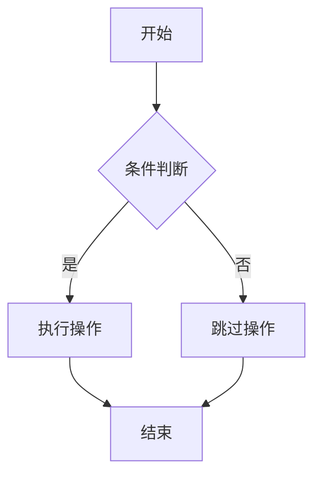

# 文档编写规范

本文档定义了Locust性能测试框架文档的编写规范和标准，确保文档的一致性、可读性和维护性。

## 📝 文档结构规范

### 1. 文档层次结构

```
docs/
├── README.md                    # 主文档入口
├── getting-started/            # 快速开始
│   ├── installation.md
│   ├── quickstart.md
│   ├── concepts.md
│   └── first-test.md
├── architecture/               # 架构设计
│   ├── overview.md
│   ├── modules.md
│   ├── plugin-system.md
│   └── data-flow.md
├── api/                       # API参考
│   ├── analysis.md
│   ├── monitoring.md
│   ├── data-manager.md
│   ├── plugins.md
│   ├── load-shapes.md
│   └── utilities.md
├── development/               # 开发指南
│   ├── setup.md
│   ├── coding-standards.md
│   ├── plugin-development.md
│   ├── load-shape-development.md
│   ├── contributing.md
│   ├── testing.md
│   └── documentation-standards.md
├── examples/                  # 示例和最佳实践
│   ├── basic-examples.md
│   ├── advanced-examples.md
│   ├── best-practices.md
│   ├── faq.md
│   └── troubleshooting.md
└── configuration/             # 配置参考
    ├── framework-config.md
    ├── plugin-config.md
    ├── monitoring-config.md
    ├── notification-config.md
    ├── development.md
    ├── testing.md
    ├── production.md
    └── distributed.md
```

### 2. 文件命名规范

- **使用小写字母和连字符**: `plugin-development.md`
- **避免空格和特殊字符**: 不使用 `Plugin Development.md`
- **描述性命名**: 文件名应清楚表达内容
- **保持简洁**: 避免过长的文件名

## 📖 内容编写规范

### 1. 文档标题结构

```markdown
# 主标题 (H1) - 每个文档只有一个

## 二级标题 (H2) - 主要章节

### 三级标题 (H3) - 子章节

#### 四级标题 (H4) - 详细内容

##### 五级标题 (H5) - 特殊情况使用

###### 六级标题 (H6) - 避免使用
```

### 2. 文档开头模板

```markdown
# 文档标题

本文档简要描述文档的目的和内容概述。

## 🎯 目标读者

明确说明文档的目标读者群体。

## 📋 前置条件

列出阅读本文档需要的前置知识或环境要求。

## 📚 内容概览

- 主要内容点1
- 主要内容点2
- 主要内容点3
```

### 3. 表情符号使用规范

使用表情符号增强文档的可读性和视觉效果：

```markdown
## 🎯 目标和目的
## 🚀 快速开始
## 📋 前置条件
## 🔧 配置说明
## 💻 代码示例
## 📊 数据和图表
## ⚠️ 注意事项
## 🐛 故障排除
## 📚 相关资源
## 🎉 总结
```

### 4. 代码块规范

#### Python代码

```python
# src/example.py
"""
模块文档字符串
"""

class ExampleClass:
    """类文档字符串"""

    def __init__(self, param: str):
        """构造函数文档"""
        self.param = param

    def example_method(self) -> str:
        """方法文档字符串"""
        return f"Example: {self.param}"

# 使用示例
example = ExampleClass("test")
result = example.example_method()
print(result)
```

#### YAML配置

```yaml
# config/example.yml
framework:
  name: "locust-framework"
  version: "2.0.0"

plugins:
  enabled:
    - analysis
    - monitoring
    - data_manager

  analysis:
    grade_thresholds:
      excellent: 0.95
      good: 0.85
      average: 0.70
```

#### Shell脚本

```bash
#!/bin/bash
# scripts/example.sh

set -e

# 变量定义
SCRIPT_DIR="$(cd "$(dirname "${BASH_SOURCE[0]}")" && pwd)"
PROJECT_ROOT="$(dirname "$SCRIPT_DIR")"

# 函数定义
function log_info() {
    echo "[INFO] $1"
}

# 主逻辑
log_info "Starting example script..."
```

### 5. 链接规范

#### 内部链接

```markdown
# 相对路径链接
- [安装指南](../getting-started/installation.md)
- [API参考](../api/analysis.md)
- [配置说明](../configuration/framework-config.md)

# 锚点链接
- [配置选项](#配置选项)
- [示例代码](#示例代码)
```

#### 外部链接

```markdown
# 外部链接
- [Locust官方文档](https://docs.locust.io/)
- [Python官方文档](https://docs.python.org/3/)
- [GitHub仓库](https://github.com/locustio/locust)
```

### 6. 表格规范

```markdown
| 参数名称 | 类型 | 默认值 | 描述 |
|---------|------|--------|------|
| `host` | string | `localhost` | 目标主机地址 |
| `port` | integer | `8080` | 目标端口号 |
| `timeout` | integer | `30` | 连接超时时间（秒） |
| `retries` | integer | `3` | 重试次数 |
```

### 7. 列表规范

#### 无序列表

```markdown
- 第一项内容
- 第二项内容
  - 子项内容
  - 另一个子项
- 第三项内容
```

#### 有序列表

```markdown
1. 第一步：环境准备
2. 第二步：安装依赖
3. 第三步：配置文件
4. 第四步：启动服务
```

### 8. 引用和提示

#### 信息提示

```markdown
> **提示**: 这是一个有用的提示信息。

> **注意**: 这是需要注意的重要信息。

> **警告**: 这是警告信息，请谨慎操作。
```

#### 代码引用

```markdown
使用 `locust` 命令启动测试，配置文件位于 `config/` 目录下。
```

## 🎨 格式化规范

### 1. 行长度限制

- **文本行**: 建议不超过80字符
- **代码行**: 建议不超过88字符
- **表格**: 根据内容适当调整

### 2. 空行使用

```markdown
# 标题前后需要空行

## 二级标题

段落内容...

### 三级标题

另一段内容...

```python
# 代码块前后需要空行
def example():
    pass
```

继续文档内容...
```

### 3. 缩进规范

- **列表缩进**: 使用2个空格
- **代码缩进**: 使用4个空格
- **引用缩进**: 使用2个空格

## 📊 图表和图像

### 1. Mermaid图表

```markdown

```

### 2. 图像引用

```markdown


*图1: 系统架构概览*
```

## 🔍 质量检查

### 1. 内容检查清单

- [ ] 标题层次结构正确
- [ ] 代码示例可执行
- [ ] 链接有效且正确
- [ ] 表格格式规范
- [ ] 表情符号使用恰当
- [ ] 语法和拼写正确
- [ ] 内容逻辑清晰

### 2. 技术审查

- [ ] 技术内容准确
- [ ] 代码示例最佳实践
- [ ] API文档与实现一致
- [ ] 配置示例有效
- [ ] 版本信息最新

### 3. 可读性检查

- [ ] 目标读者明确
- [ ] 内容组织合理
- [ ] 示例充分且清晰
- [ ] 术语使用一致
- [ ] 交叉引用完整

## 🛠️ 工具和自动化

### 1. 文档生成工具

```bash
# 使用MkDocs生成文档站点
pip install mkdocs mkdocs-material
mkdocs serve

# 使用Sphinx生成文档
pip install sphinx sphinx-rtd-theme
sphinx-build -b html docs/ docs/_build/
```

### 2. 链接检查

```bash
# 检查文档中的链接
pip install markdown-link-check
find docs -name "*.md" -exec markdown-link-check {} \;
```

### 3. 格式化工具

```bash
# 使用Prettier格式化Markdown
npm install -g prettier
prettier --write "docs/**/*.md"

# 使用markdownlint检查格式
npm install -g markdownlint-cli
markdownlint docs/**/*.md
```

## 📝 文档维护

### 1. 版本控制

- 每次重大更新都要更新版本号
- 在文档中标注最后更新时间
- 保持变更日志记录

### 2. 定期审查

- **月度审查**: 检查链接有效性
- **季度审查**: 更新过时内容
- **年度审查**: 重构文档结构

### 3. 反馈收集

- 在文档中提供反馈渠道
- 定期收集用户意见
- 根据反馈改进文档

## 📚 参考资源

### 文档编写指南

- [Markdown语法指南](https://www.markdownguide.org/)
- [技术写作最佳实践](https://developers.google.com/tech-writing)
- [文档即代码](https://www.writethedocs.org/guide/docs-as-code/)

### 工具文档

- [MkDocs文档](https://www.mkdocs.org/)
- [Sphinx文档](https://www.sphinx-doc.org/)
- [Mermaid图表](https://mermaid-js.github.io/mermaid/)

## 🎉 总结

遵循这些文档编写规范将确保：

1. **一致性**: 所有文档保持统一的风格和格式
2. **可读性**: 用户能够轻松理解和使用文档
3. **可维护性**: 文档易于更新和维护
4. **专业性**: 提供高质量的用户体验

记住，好的文档是项目成功的关键因素之一！

---

**最后更新**: 2024-01-01
**版本**: v1.0.0
