# 插件开发指南

本指南详细介绍如何为Locust性能测试框架开发自定义插件，包括插件类型、开发流程和最佳实践。

## 🎯 插件系统概述

### 插件架构

框架采用基于接口的插件架构，支持10+种不同类型的插件：

```python
# 插件类型层次结构
PluginInterface (基础接口)
├── LocustPlugin (Locust功能扩展)
├── ReportPlugin (报告生成)
├── MonitorPlugin (监控指标)
├── DataPlugin (数据源)
├── NotificationPlugin (通知渠道)
├── LoadShapePlugin (负载模式)
├── AnalysisPlugin (分析算法)
├── StoragePlugin (存储后端)
├── AuthenticationPlugin (认证方式)
└── ProtocolPlugin (协议支持)
```

### 插件生命周期

```mermaid
graph LR
    A[发现] --> B[加载]
    B --> C[验证]
    C --> D[初始化]
    D --> E[启用]
    E --> F[运行]
    F --> G[禁用]
    G --> H[卸载]
```



## 🔧 开发环境准备

### 1. 项目结构

```bash
my_plugin/
├── __init__.py
├── plugin.py              # 主插件文件
├── config.py              # 配置定义
├── utils.py               # 工具函数
├── tests/                 # 测试文件
│   ├── __init__.py
│   └── test_plugin.py
├── README.md              # 插件说明
├── requirements.txt       # 依赖列表
└── setup.py              # 安装脚本
```

### 2. 基础依赖

```python
# requirements.txt
locust>=2.0.0
dynaconf>=3.1.0
loguru>=0.6.0
```

## 📝 插件开发步骤

### 步骤1：定义插件信息

```python
# plugin.py
from dataclasses import dataclass
from typing import Dict, Any, Optional

@dataclass
class PluginInfo:
    """插件信息"""
    name: str
    version: str
    description: str
    author: str
    category: str
    dependencies: Optional[list] = None
    config_schema: Optional[Dict[str, Any]] = None
```

### 步骤2：选择插件类型

根据功能需求选择合适的插件基类：

#### ReportPlugin - 报告生成插件

```python
from src.plugins.plugin_interface import ReportPlugin, PluginInfo

class MyReportPlugin(ReportPlugin):
    """自定义报告插件示例"""

    @property
    def plugin_info(self) -> PluginInfo:
        return PluginInfo(
            name="My Report Plugin",
            version="1.0.0",
            description="生成自定义格式的测试报告",
            author="Your Name",
            category="report",
            dependencies=["jinja2", "matplotlib"],
            config_schema={
                "output_format": {"type": "string", "default": "pdf"},
                "include_charts": {"type": "boolean", "default": True}
            }
        )

    def initialize(self, config: Optional[Dict[str, Any]] = None) -> bool:
        """初始化插件"""
        self.config = config or {}
        self.output_format = self.config.get('output_format', 'pdf')
        self.include_charts = self.config.get('include_charts', True)

        # 验证依赖
        try:
            import jinja2
            import matplotlib
            return True
        except ImportError as e:
            self.logger.error(f"缺少依赖: {e}")
            return False

    def cleanup(self):
        """清理资源"""
        # 清理临时文件、关闭连接等
        pass

    def generate_report(self, test_data: Dict[str, Any],
                       output_path: str) -> bool:
        """生成报告的核心方法"""
        try:
            if self.output_format == 'pdf':
                return self._generate_pdf_report(test_data, output_path)
            elif self.output_format == 'excel':
                return self._generate_excel_report(test_data, output_path)
            else:
                self.logger.error(f"不支持的输出格式: {self.output_format}")
                return False
        except Exception as e:
            self.logger.error(f"报告生成失败: {e}")
            return False

    def get_supported_formats(self) -> list:
        """返回支持的报告格式"""
        return ['pdf', 'excel']

    def _generate_pdf_report(self, test_data: Dict[str, Any],
                            output_path: str) -> bool:
        """生成PDF报告"""
        # 实现PDF报告生成逻辑
        self.logger.info(f"生成PDF报告: {output_path}")
        return True

    def _generate_excel_report(self, test_data: Dict[str, Any],
                              output_path: str) -> bool:
        """生成Excel报告"""
        # 实现Excel报告生成逻辑
        self.logger.info(f"生成Excel报告: {output_path}")
        return True
```

#### MonitorPlugin - 监控插件

```python
from src.plugins.plugin_interface import MonitorPlugin, PluginInfo

class SystemMonitorPlugin(MonitorPlugin):
    """系统监控插件"""

    @property
    def plugin_info(self) -> PluginInfo:
        return PluginInfo(
            name="System Monitor",
            version="1.0.0",
            description="监控系统资源使用情况",
            author="Your Name",
            category="monitor",
            dependencies=["psutil"]
        )

    def initialize(self, config: Optional[Dict[str, Any]] = None) -> bool:
        """初始化监控插件"""
        try:
            import psutil
            self.psutil = psutil
            return True
        except ImportError:
            self.logger.error("缺少psutil依赖")
            return False

    def cleanup(self):
        """清理资源"""
        pass

    def collect_metrics(self) -> Dict[str, Any]:
        """收集监控指标"""
        try:
            return {
                'cpu_percent': self.psutil.cpu_percent(interval=1),
                'memory_percent': self.psutil.virtual_memory().percent,
                'disk_usage': self.psutil.disk_usage('/').percent,
                'network_io': dict(self.psutil.net_io_counters()._asdict()),
                'timestamp': time.time()
            }
        except Exception as e:
            self.logger.error(f"指标收集失败: {e}")
            return {}

    def get_metric_definitions(self) -> Dict[str, Dict[str, Any]]:
        """返回指标定义"""
        return {
            'cpu_percent': {
                'name': 'CPU使用率',
                'unit': '%',
                'type': 'gauge'
            },
            'memory_percent': {
                'name': '内存使用率',
                'unit': '%',
                'type': 'gauge'
            },
            'disk_usage': {
                'name': '磁盘使用率',
                'unit': '%',
                'type': 'gauge'
            }
        }
```

#### DataPlugin - 数据源插件

```python
from src.plugins.plugin_interface import DataPlugin, PluginInfo

class DatabaseDataPlugin(DataPlugin):
    """数据库数据源插件"""

    @property
    def plugin_info(self) -> PluginInfo:
        return PluginInfo(
            name="Database Data Source",
            version="1.0.0",
            description="从数据库加载测试数据",
            author="Your Name",
            category="data",
            dependencies=["pymysql"],
            config_schema={
                "host": {"type": "string", "required": True},
                "port": {"type": "integer", "default": 3306},
                "database": {"type": "string", "required": True},
                "username": {"type": "string", "required": True},
                "password": {"type": "string", "required": True}
            }
        )

    def initialize(self, config: Optional[Dict[str, Any]] = None) -> bool:
        """初始化数据库连接"""
        self.config = config or {}
        try:
            import pymysql
            self.connection = pymysql.connect(
                host=self.config['host'],
                port=self.config.get('port', 3306),
                database=self.config['database'],
                user=self.config['username'],
                password=self.config['password']
            )
            return True
        except Exception as e:
            self.logger.error(f"数据库连接失败: {e}")
            return False

    def cleanup(self):
        """关闭数据库连接"""
        if hasattr(self, 'connection'):
            self.connection.close()

    def load_data(self, data_type: str, **kwargs) -> list:
        """加载数据"""
        try:
            cursor = self.connection.cursor()

            if data_type == 'users':
                cursor.execute("SELECT * FROM users LIMIT %s",
                              (kwargs.get('limit', 100),))
            elif data_type == 'products':
                cursor.execute("SELECT * FROM products LIMIT %s",
                              (kwargs.get('limit', 100),))
            else:
                raise ValueError(f"不支持的数据类型: {data_type}")

            results = cursor.fetchall()
            cursor.close()
            return results

        except Exception as e:
            self.logger.error(f"数据加载失败: {e}")
            return []

    def get_supported_data_types(self) -> list:
        """返回支持的数据类型"""
        return ['users', 'products', 'orders']
```

### 步骤3：实现事件处理

```python
class MyPlugin(ReportPlugin):
    """支持事件处理的插件"""

    def initialize(self, config: Optional[Dict[str, Any]] = None) -> bool:
        """初始化时注册事件处理器"""
        # 注册事件处理器
        self.register_event_handler('test_start', self.on_test_start)
        self.register_event_handler('test_stop', self.on_test_stop)
        self.register_event_handler('request_success', self.on_request_success)
        self.register_event_handler('request_failure', self.on_request_failure)
        return True

    def on_test_start(self, environment, **kwargs):
        """测试开始事件处理"""
        self.logger.info("测试开始，初始化插件状态")
        self.start_time = time.time()

    def on_test_stop(self, environment, **kwargs):
        """测试结束事件处理"""
        self.logger.info("测试结束，生成最终报告")
        self.end_time = time.time()
        # 生成报告逻辑

    def on_request_success(self, request_type, name, response_time,
                          response_length, **kwargs):
        """请求成功事件处理"""
        # 记录成功请求
        pass

    def on_request_failure(self, request_type, name, response_time,
                          response_length, exception, **kwargs):
        """请求失败事件处理"""
        # 记录失败请求
        pass
```

### 步骤4：配置管理

```python
# config.py
from typing import Dict, Any
from dataclasses import dataclass

@dataclass
class PluginConfig:
    """插件配置类"""
    output_directory: str = "reports"
    file_format: str = "html"
    include_charts: bool = True
    chart_theme: str = "default"

    @classmethod
    def from_dict(cls, config_dict: Dict[str, Any]) -> 'PluginConfig':
        """从字典创建配置对象"""
        return cls(**{k: v for k, v in config_dict.items()
                     if k in cls.__annotations__})

    def validate(self) -> bool:
        """验证配置有效性"""
        if not self.output_directory:
            return False
        if self.file_format not in ['html', 'pdf', 'excel']:
            return False
        return True

# 在插件中使用配置
class MyPlugin(ReportPlugin):
    def initialize(self, config: Optional[Dict[str, Any]] = None) -> bool:
        self.config = PluginConfig.from_dict(config or {})
        if not self.config.validate():
            self.logger.error("插件配置无效")
            return False
        return True
```

## 🧪 插件测试

### 单元测试

```python
# tests/test_plugin.py
import unittest
from unittest.mock import Mock, patch
from my_plugin.plugin import MyReportPlugin

class TestMyReportPlugin(unittest.TestCase):
    """插件单元测试"""

    def setUp(self):
        """测试准备"""
        self.plugin = MyReportPlugin()
        self.test_config = {
            'output_format': 'pdf',
            'include_charts': True
        }

    def test_plugin_info(self):
        """测试插件信息"""
        info = self.plugin.plugin_info
        self.assertEqual(info.name, "My Report Plugin")
        self.assertEqual(info.version, "1.0.0")
        self.assertEqual(info.category, "report")

    def test_initialize_success(self):
        """测试初始化成功"""
        result = self.plugin.initialize(self.test_config)
        self.assertTrue(result)
        self.assertEqual(self.plugin.output_format, 'pdf')

    def test_initialize_failure(self):
        """测试初始化失败"""
        with patch('my_plugin.plugin.jinja2', side_effect=ImportError):
            result = self.plugin.initialize(self.test_config)
            self.assertFalse(result)

    def test_generate_report(self):
        """测试报告生成"""
        self.plugin.initialize(self.test_config)
        test_data = {'test_name': 'test', 'requests': []}

        result = self.plugin.generate_report(test_data, 'test_report.pdf')
        self.assertTrue(result)

    def test_supported_formats(self):
        """测试支持的格式"""
        formats = self.plugin.get_supported_formats()
        self.assertIn('pdf', formats)
        self.assertIn('excel', formats)

if __name__ == '__main__':
    unittest.main()
```

### 集成测试

```python
# tests/test_integration.py
import unittest
from src.plugins.plugin_manager import PluginManager
from my_plugin.plugin import MyReportPlugin

class TestPluginIntegration(unittest.TestCase):
    """插件集成测试"""

    def setUp(self):
        """测试准备"""
        self.plugin_manager = PluginManager()

    def test_plugin_loading(self):
        """测试插件加载"""
        # 注册插件
        self.plugin_manager.register_plugin('my_report_plugin', MyReportPlugin)

        # 启用插件
        success = self.plugin_manager.enable_plugin('my_report_plugin', {
            'output_format': 'pdf'
        })
        self.assertTrue(success)

        # 检查插件状态
        status = self.plugin_manager.get_plugin_status()
        self.assertTrue(status['my_report_plugin']['enabled'])

    def test_event_handling(self):
        """测试事件处理"""
        self.plugin_manager.register_plugin('my_report_plugin', MyReportPlugin)
        self.plugin_manager.enable_plugin('my_report_plugin')

        # 触发事件
        self.plugin_manager.trigger_event('test_start', {'test_name': 'test'})

        # 验证事件处理结果
        # ...
```

## 📦 插件打包和分发

### 1. 创建setup.py

```python
# setup.py
from setuptools import setup, find_packages

setup(
    name="my-locust-plugin",
    version="1.0.0",
    description="自定义Locust插件",
    author="Your Name",
    author_email="your.email@example.com",
    packages=find_packages(),
    install_requires=[
        "locust>=2.0.0",
        "dynaconf>=3.1.0",
        "loguru>=0.6.0",
        "jinja2>=3.0.0",
        "matplotlib>=3.5.0"
    ],
    classifiers=[
        "Development Status :: 4 - Beta",
        "Intended Audience :: Developers",
        "License :: OSI Approved :: MIT License",
        "Programming Language :: Python :: 3",
        "Programming Language :: Python :: 3.7",
        "Programming Language :: Python :: 3.8",
        "Programming Language :: Python :: 3.9",
    ],
    python_requires=">=3.7",
    entry_points={
        "locust.plugins": [
            "my_report_plugin = my_plugin.plugin:MyReportPlugin",
        ]
    }
)
```

### 2. 创建插件清单

```python
# plugin_manifest.json
{
    "name": "my-report-plugin",
    "version": "1.0.0",
    "description": "自定义报告生成插件",
    "author": "Your Name",
    "category": "report",
    "entry_point": "my_plugin.plugin:MyReportPlugin",
    "dependencies": [
        "jinja2>=3.0.0",
        "matplotlib>=3.5.0"
    ],
    "config_schema": {
        "type": "object",
        "properties": {
            "output_format": {
                "type": "string",
                "enum": ["pdf", "excel"],
                "default": "pdf"
            },
            "include_charts": {
                "type": "boolean",
                "default": true
            }
        }
    },
    "supported_events": [
        "test_start",
        "test_stop",
        "request_success",
        "request_failure"
    ]
}
```

## 🎯 最佳实践

### 1. 设计原则

- **单一职责**: 每个插件专注一个特定功能
- **松耦合**: 减少对框架内部实现的依赖
- **可配置**: 提供灵活的配置选项
- **错误处理**: 完善的异常处理和日志记录

### 2. 性能优化

```python
class OptimizedPlugin(ReportPlugin):
    """性能优化的插件示例"""

    def __init__(self):
        super().__init__()
        self._cache = {}  # 缓存机制
        self._pool = None  # 连接池

    def initialize(self, config: Optional[Dict[str, Any]] = None) -> bool:
        # 初始化连接池
        self._pool = self._create_connection_pool()
        return True

    def generate_report(self, test_data: Dict[str, Any],
                       output_path: str) -> bool:
        # 使用缓存避免重复计算
        cache_key = self._generate_cache_key(test_data)
        if cache_key in self._cache:
            return self._use_cached_result(cache_key, output_path)

        # 异步处理大量数据
        result = self._process_data_async(test_data)
        self._cache[cache_key] = result

        return self._write_report(result, output_path)
```

### 3. 安全考虑

```python
class SecurePlugin(ReportPlugin):
    """安全的插件示例"""

    def initialize(self, config: Optional[Dict[str, Any]] = None) -> bool:
        # 验证配置安全性
        if not self._validate_config_security(config):
            return False

        # 设置安全的文件权限
        self._setup_secure_permissions()
        return True

    def _validate_config_security(self, config: Dict[str, Any]) -> bool:
        """验证配置安全性"""
        # 检查路径遍历攻击
        output_path = config.get('output_path', '')
        if '..' in output_path or output_path.startswith('/'):
            self.logger.error("不安全的输出路径")
            return False

        return True

    def _sanitize_input(self, data: str) -> str:
        """清理输入数据"""
        # 移除潜在的恶意字符
        import re
        return re.sub(r'[<>"\']', '', data)
```

## 🔧 调试和故障排除

### 1. 调试技巧

```python
class DebuggablePlugin(ReportPlugin):
    """可调试的插件"""

    def initialize(self, config: Optional[Dict[str, Any]] = None) -> bool:
        # 启用调试模式
        self.debug_mode = config.get('debug', False)

        if self.debug_mode:
            self.logger.setLevel('DEBUG')
            self.logger.debug("插件调试模式已启用")

        return True

    def generate_report(self, test_data: Dict[str, Any],
                       output_path: str) -> bool:
        if self.debug_mode:
            self.logger.debug(f"开始生成报告: {output_path}")
            self.logger.debug(f"测试数据大小: {len(test_data.get('requests', []))}")

        try:
            result = self._do_generate_report(test_data, output_path)

            if self.debug_mode:
                self.logger.debug(f"报告生成{'成功' if result else '失败'}")

            return result
        except Exception as e:
            self.logger.error(f"报告生成异常: {e}", exc_info=True)
            return False
```

### 2. 常见问题

| 问题 | 原因 | 解决方案 |
|------|------|----------|
| 插件加载失败 | 依赖缺失 | 检查requirements.txt |
| 配置验证失败 | 配置格式错误 | 验证配置schema |
| 内存泄漏 | 资源未释放 | 实现cleanup方法 |
| 性能问题 | 阻塞操作 | 使用异步处理 |

## 📚 参考资源

- [插件接口API](../api/plugins.md) - 详细API文档
- [框架架构](../architecture/overview.md) - 架构设计说明
- [配置管理](../configuration/plugin-config.md) - 配置选项
- [示例插件](../../src/plugins/builtin/) - 内置插件源码

---

通过遵循本指南，您可以开发出高质量、可维护的插件，为框架添加强大的扩展功能。
